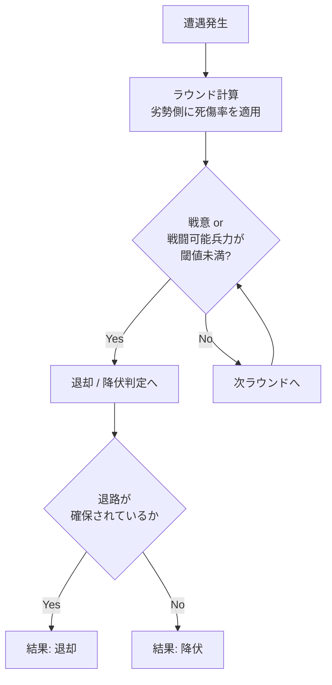
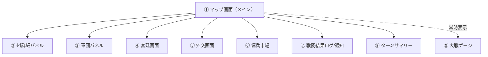
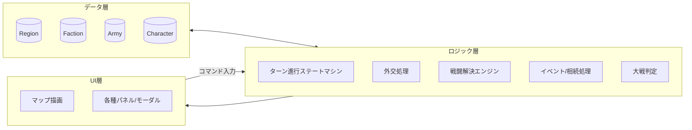

# ゲームシステム設計書（概要設計）

対象コンセプト: `gamesystem_europe.md`「会議は踊る、されど進まず」

本書は世界観・戦闘・勢力仕様（`gamesystem_europe.md`）を実装可能な粒度に落とし込んだ、
UI設計と処理（ゲームロジック）の概要設計である。局地戦の戦術描写は行わず、
戦闘はすべて演算で抽象化し、結果として **占領（領有）／退却／降伏** と
**人的・物的損耗** のみを提示する方針を貫く。

---

## 1. ゲーム全体構造

### 1.1 基本ループ

- 1ターン = 1年。神聖ローマ帝国成立（962年）からスタートし、大戦発生でゲーム終了。
- プレイヤーは1つの勢力（領主家 or 傭兵隊）を操作し、他勢力はAIが行動する。
- 各ターンは5フェイズの固定進行。全フェイズが終わると年が1つ進む。


| # | フェイズ | 内容 |
|---|---|---|
| ① 年始 | 疫病・宗教イベント抽選、出生/死亡・相続処理、経済更新の適用 |
| ② 外交 | 宣戦布告・同盟・婚姻協定・傭兵契約などの意思表示（プレイヤー入力＋AI解決） |
| ③ 行動 | 各キャラクター（君主／宰相／戦闘隊長）が年間アクションを1つ以上実行 |
| ④ 戦闘解決 | 同一州に敵対軍が存在する場合、抽象戦闘演算を実行し結果を確定 |
| ⑤ 年末集計 | 占領地確定、税収・維持費計算、大戦条件チェック、次年へ |

### 1.2 役職とアクション（`gamesystem_europe.md` 準拠）

| 役職 | 所属 | アクション |
|---|---|---|
| 君主 | 領主家 | 外交、宣戦布告、子作り、海外開発、婚姻（政略結婚） |
| 宰相 | 領主家/傭兵団（経済担当） | 人材登用、外交、商業、税収管理 |
| 戦闘隊長 | 領主家/傭兵団 | 部隊編成、移動、戦闘、退却、略奪、人質売買 |

- 1キャラクター＝1年に消費できる行動力（AP）は基本1〜2（役職ごとの上限をパラメータ化）。
- 領主家は宰相・戦闘隊長を複数人保有できる → 並列アクションが可能（同時に複数正面で外交/戦争を回せる）。
- 傭兵隊長は領地を持たず、雇用主から報酬・身代金・略奪で収入を得る。臣従はしない（契約満了/破棄が常に可能）。

---

## 2. データモデル（概要設計）

### 2.1 マップ／州（Region）

```jsonc
{
  "id": "region_burgundy",
  "name": "ブルゴーニュ",
  "owner": "faction_habsburg",
  "terrain": "plain",        // plain / hill / mountain / forest / coast
  "terrainModifier": { "attack": 1.0, "defense": 1.1 },
  "population": 120000,
  "taxBase": 800,
  "garrison": { "count": 1500, "training": 0.6 }, // 常備兵（州直属）
  "adjacency": ["region_lorraine", "region_champagne", "region_franche_comte"],
  "fortified": false,        // true の場合は「持久戦（包囲）」ルールが適用
  "siege": null              // 包囲中なら { attacker, startTurn, supplyState }
}
```

### 2.2 勢力（Faction）

```jsonc
{
  "id": "faction_habsburg",
  "type": "lord",            // "lord"（領主）| "mercenary"（傭兵団）
  "ruler": "char_rudolf",
  "consort": "char_anna",
  "children": ["char_albrecht"],
  "chancellors": ["char_hans"],       // 宰相（複数可）
  "warlords": ["char_gottfried"],     // 戦闘隊長（複数可）
  "regions": ["region_burgundy", "region_swabia"],
  "treasury": 4200,
  "diplomacy": { "faction_valois": "war", "faction_wittelsbach": "alliance" },
  "atWar": true
}
```

### 2.3 軍団（Army）

```jsonc
{
  "id": "army_001",
  "faction": "faction_habsburg",
  "commander": "char_gottfried",     // 戦闘隊長。null なら指揮官なし（弱体化）
  "location": "region_lorraine",
  "units": [
    { "type": "pike", "count": 3000, "training": 0.7 },
    { "type": "cavalry", "count": 800, "training": 0.65 },
    { "type": "archer", "count": 500, "training": 0.5 }
  ],
  "doctrine": "swiss_pike",          // 戦術洗練度の元になる編成/時代要素
  "morale": 0.8,                     // 戦意（0〜1）
  "supply": 0.9                      // 補給状態。持久戦・移動距離で低下
}
```

### 2.4 人物（Character）

```jsonc
{
  "id": "char_gottfried",
  "name": "ゴットフリート",
  "role": "warlord",                 // ruler / chancellor / warlord
  "skill": { "command": 0.8, "diplomacy": 0.3, "administration": 0.2 },
  "traits": ["cavalry_specialist"],  // 指揮官特性 → 戦術洗練度補正
  "age": 34,
  "alive": true
}
```

---

## 3. 戦闘解決システム（抽象演算）

局地戦画面には遷移しない。**同一州に敵対軍が同時に存在した瞬間に演算のみで決着する。**

### 3.1 戦闘力の算出

```
戦闘力(CP) = Σ(兵科ごとの 兵数 × 練度) × 戦術洗練度係数 × 状況補正
```

- **戦術洗練度係数**：時代（スイス槍兵、イングランド長弓、ナポレオン式など）と指揮官特性の組み合わせで決定するテーブル値。
- **状況補正**：
  - 地形補正（`terrainModifier`）
  - 奇襲補正：隣接州に敵の優秀な指揮官がいて先制条件を満たす場合
  - 挟撃補正：複数方向から同時侵入した味方軍がいる場合
  - 兵科相性：騎兵・弓兵は「数の多寡によらず」地形・相手兵科条件で優劣が反転するケースを持つ（例：平地での騎兵突撃 vs 密集槍兵、森林での弓兵不利）

### 3.2 ラウンド処理（遭遇戦）

戦闘は抽象的な複数ラウンド（既定3ラウンド）で解決し、都度ログに要約を残す。



疑似コード：

```python
def resolve_battle(attacker: Army, defender: Army, region: Region) -> BattleResult:
    for round_n in range(MAX_ROUNDS):
        cp_a = combat_power(attacker, region, side="attack")
        cp_d = combat_power(defender, region, side="defense")
        ratio = cp_a / (cp_a + cp_d)

        casualties_d = defender.effective_strength * loss_rate(ratio)
        casualties_a = attacker.effective_strength * loss_rate(1 - ratio)
        apply_casualties(defender, casualties_d)
        apply_casualties(attacker, casualties_a)

        apply_morale_shock(defender, ratio)
        apply_morale_shock(attacker, 1 - ratio)

        loser = weaker_side(attacker, defender)
        if is_broken(loser):  # 戦意 or 稼働兵力が閾値未満
            if has_escape_route(loser, region):
                return BattleResult.RETREAT(loser, casualties_a, casualties_d)
            else:
                return BattleResult.SURRENDER(loser, casualties_a, casualties_d)

    return BattleResult.INCONCLUSIVE(casualties_a, casualties_d)  # 双方消耗のみ、州は動かず
```

### 3.3 結果の3類型と後処理

| 結果 | 発生条件 | 後処理 |
|---|---|---|
| **占領（領有）** | 州の防衛側が野戦で敗北し降伏、または包囲（持久戦）が補給切れで陥落 | `region.owner` を勝者勢力へ更新。人口・税基盤に応じ略奪/接収の追加処理を実行可 |
| **退却** | 敗北側に退路（隣接する自勢力/中立地）がある | 敗走側は当該州から撤退、州の所有者は変わらない。双方の兵力・戦意は減少したまま次ターンへ |
| **降伏** | 敗北側に退路がない（包囲下・孤立） | 敗走側の軍は解体（捕虜化）。指揮官が捕縛された場合は身代金交渉イベントへ（傭兵システムと連動） |

### 3.4 持久戦（包囲）ルール

- 城塞化（`fortified: true`）された州は野戦一発では陥落せず、`siege` 状態に入る。
- 包囲中は毎ターン `supplyState` が減衰し、閾値割れで自動的に「降伏」判定。
- 解囲は、外部から援軍が到達し攻城側に対して野戦を仕掛け勝利すること。

### 3.5 損耗の抽象表現（UI表示用）

戦闘結果は以下の数値のみを提示し、個々の兵士描写は行わない。

- 死傷者数（攻撃側／防御側）
- 捕虜数（降伏時）
- 物資損耗（略奪発生時の税基盤・人口への影響）
- 戦意・練度の低下（次戦に影響する内部値。UI上はゲージ表示のみ）

---

## 4. 大戦判定システム

- 年末集計フェイズで、全生存勢力のうち `atWar == true` の割合を算出。
- 割合が **2/3以上** に達した瞬間、大戦が発生しゲーム終了。参戦した全勢力は敗北扱い。
- UI常時表示の「大戦ゲージ」で現在の戦争状態勢力比率を可視化し、プレイヤーに警告する。

```
war_ratio = count(faction.atWar == true) / count(faction.alive == true)
if war_ratio >= 2/3:
    trigger_great_war_ending()  # 参戦国すべて敗北
```

---

## 5. UI設計

### 5.1 画面構成



| # | 画面 | 目的 | 主要UI要素 |
|---|---|---|---|
| ① マップ画面 | 全体状況把握・メイン操作起点 | 州ごとの勢力色分け、軍団アイコン、州クリックで②起動、右上に⑨大戦ゲージ常設 |
| ② 州詳細パネル | 州単位の情報確認・命令 | 州名/領有者/人口/税基盤/駐留戦力/地形/隣接州リスト、包囲中は補給ゲージ |
| ③ 軍団パネル | 軍の編成・命令 | 兵科構成、練度・戦意ゲージ、指揮官、コマンドボタン（移動／攻撃／退却／略奪／解散） |
| ④ 宮廷画面 | 人物・家系管理 | 家系図、婚姻コマンド、宰相・戦闘隊長の一覧と登用/罷免 |
| ⑤ 外交画面 | 対外関係操作 | 勢力別関係値、宣戦布告／同盟／和平／婚姻協定ボタン |
| ⑥ 傭兵市場 | 傭兵団の雇用 | 傭兵団一覧（戦力・戦術傾向・契約金）、雇用コマンド |
| ⑦ 戦闘結果ログ | 戦闘の事後報告 | 州名・勝敗・結果種別（占領/退却/降伏）・死傷者数・捕虜数をリスト表示（テキスト主体、演出無し） |
| ⑧ ターンサマリー | 年始イベント通知 | 疫病発生、後継者誕生/死亡、宗教改革などのイベントカード |
| ⑨ 大戦ゲージ | 常時警告表示 | 戦争状態勢力比率のプログレスバー、2/3到達で警告色 |

### 5.2 画面遷移とモーダル方針

- 戦闘結果は**画面遷移せずモーダル/サイドパネルで完結**（局地戦画面は作らない）。
- ターン進行は「行動フェイズ終了」ボタンで確定 → ④戦闘解決 → ⑤集計 が自動実行され、結果は⑦⑧に集約されて提示。
- プレイヤーの役職別ビュー切り替え（君主／宰相／戦闘隊長）をマップ画面上部タブで提供し、それぞれの担当コマンドのみをハイライト。

### 5.3 州詳細パネルのワイヤーフレーム（テキスト表現）

```
┌──────────────────────────────┐
│ ブルゴーニュ                    │
│ 領有: ハプスブルク家              │
│ 人口: 120,000  税基盤: 800       │
│ 地形: 平地  城塞: なし            │
│ 駐留戦力: 1,500 (練度 60%)        │
│ ─────────────────────────── │
│ 隣接: ロレーヌ / シャンパーニュ / …  │
│ ─────────────────────────── │
│ [ 軍団を送る ] [ 開発する ] [ 閉じる ]│
└──────────────────────────────┘
```

### 5.4 戦闘結果ログのワイヤーフレーム

```
┌──────────────────────────────┐
│ 1523年 戦闘結果                 │
│ ─────────────────────────── │
│ ロレーヌ：ハプスブルク軍 勝利         │
│  結果: 占領                     │
│  死傷者: 味方 320 / 敵 1,150      │
│  捕虜: 400                     │
│ ─────────────────────────── │
│ シャンパーニュ：ヴァロワ軍 退却        │
│  死傷者: 味方 210 / 敵 480       │
└──────────────────────────────┘
```

---

## 6. 処理アーキテクチャ（概要）



- **TurnFSM**：本書 1.1 の5フェイズを管理する有限状態機械。各フェイズの完了で次フェイズへ自動遷移。
- **CombatEngine**：3章の演算を実装。入力＝両軍のArmy/Region、出力＝BattleResult（結果種別＋損耗値）。
- **EventEngine**：疫病・宗教・相続などランダム/条件イベントの抽選と適用。
- **WarCheck**：年末集計フェイズで大戦条件を評価し、該当時はゲーム終了処理を呼ぶ。
- UI層はロジック層が確定した状態のみを描画するイミュータブルな一方向データフローとし、演出的なアニメーションは持たない（仕様上「結果だけ表示」のため）。

### 6.1 実装方針（参考）

- Web SPA（例：TypeScript + React or Vue）＋ SVGベースの州マップを想定。州ポリゴンはGeoJSON等で管理し、州IDでデータ層と紐付け。
- ロジック層はUIから独立した純粋関数群として実装し、後日CLI/バッチでのバランス検証やAI思考ルーチンのテストを容易にする。
- セーブデータは State（Regions/Factions/Armies/Characters + 現在ターン数）のスナップショットとして永続化。

---

## 7. 今後の詳細設計項目（次工程）

- 戦術洗練度テーブルの具体値（時代×指揮官特性のマトリクス）
- AI勢力の意思決定ロジック（外交・宣戦・軍配置の優先順位）
- 傭兵隊長の契約・身代金・略奪の経済モデル詳細
- 宗教・疫病イベントの発生条件とパラメータ影響range
- バランス調整用のシミュレーション/テストハーネス
