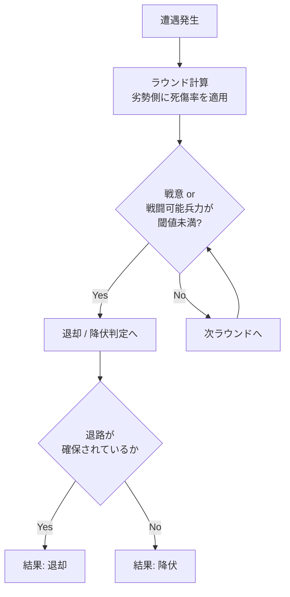
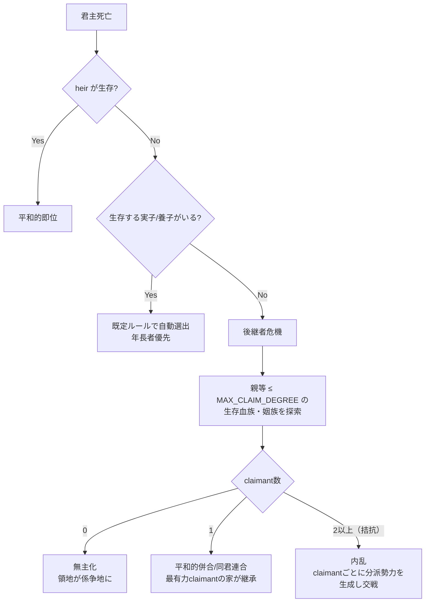
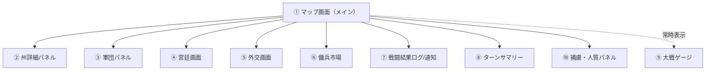
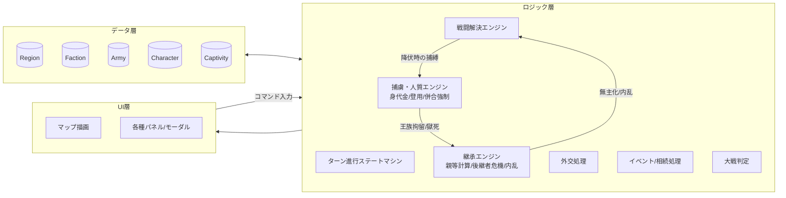

# ゲームシステム設計書（概要設計）

対象コンセプト: `gamesystem_europe.md`「会議は踊る、されど進まず」

本書は世界観・戦闘・勢力仕様（`gamesystem_europe.md`）を実装可能な粒度に落とし込んだ、
UI設計と処理（ゲームロジック）の概要設計である。局地戦の戦術描写は行わず、
戦闘はすべて演算で抽象化し、結果として **占領（領有）／退却／降伏** と
**人的・物的損耗** のみを提示する方針を貫く。

---

## 1. ゲーム全体構造

### 1.1 基本ループ

- 1ターン = 1年。神聖ローマ帝国成立（962年）からスタートし、大戦発生でゲーム終了。
- プレイヤーは1つの勢力（領主家 or 傭兵隊）を操作し、他勢力はAIが行動する。
- 各ターンは5フェイズの固定進行。全フェイズが終わると年が1つ進む。


| # | フェイズ | 内容 |
|---|---|---|
| ① 年始 | 疫病・宗教イベント抽選、出生/死亡・相続処理、経済更新の適用 |
| ② 外交 | 宣戦布告・同盟・婚姻協定・傭兵契約などの意思表示（プレイヤー入力＋AI解決） |
| ③ 行動 | 各キャラクター（君主／宰相／戦闘隊長）が年間アクションを1つ以上実行 |
| ④ 戦闘解決 | 同一州に敵対軍が存在する場合、抽象戦闘演算を実行し結果を確定 |
| ⑤ 年末集計 | 占領地確定、税収・維持費計算、大戦条件チェック、次年へ |

### 1.2 役職とアクション（`gamesystem_europe.md` 準拠）

| 役職 | 所属 | アクション |
|---|---|---|
| 君主 | 領主家 | 外交、宣戦布告、子作り、海外開発、婚姻（政略結婚）、**後継指定、養子縁組** |
| 宰相 | 領主家/傭兵団（経済担当） | 人材登用、外交、商業、税収管理 |
| 戦闘隊長 | 領主家/傭兵団 | 部隊編成、移動、戦闘、退却、略奪、人質売買 |

- 「後継指定」「養子縁組」は4章、人質売買（身代金交渉・人質提供）は5章で詳細を定義する。

- 1キャラクター＝1年に消費できる行動力（AP）は基本1〜2（役職ごとの上限をパラメータ化）。
- 領主家は宰相・戦闘隊長を複数人保有できる → 並列アクションが可能（同時に複数正面で外交/戦争を回せる）。
- 傭兵隊長は領地を持たず、雇用主から報酬・身代金・略奪で収入を得る。臣従はしない（契約満了/破棄が常に可能）。

---

## 2. データモデル（概要設計）

### 2.1 マップ／州（Region）

```jsonc
{
  "id": "region_burgundy",
  "name": "ブルゴーニュ",
  "owner": "faction_habsburg",
  "terrain": "plain",        // plain / hill / mountain / forest / coast
  "terrainModifier": { "attack": 1.0, "defense": 1.1 },
  "population": 120000,
  "taxBase": 800,
  "garrison": { "count": 1500, "training": 0.6 }, // 常備兵（州直属）
  "adjacency": ["region_lorraine", "region_champagne", "region_franche_comte"],
  "fortified": false,        // true の場合は「持久戦（包囲）」ルールが適用
  "siege": null              // 包囲中なら { attacker, startTurn, supplyState }
}
```

### 2.2 勢力（Faction）

```jsonc
{
  "id": "faction_habsburg",
  "type": "lord",            // "lord"（領主）| "mercenary"（傭兵団）
  "ruler": "char_rudolf",
  "consort": "char_anna",
  "children": ["char_albrecht"],
  "heir": "char_albrecht",            // 後継指定（null なら死亡時に自動選出 or 後継者危機、4章参照）
  "chancellors": ["char_hans"],       // 宰相（複数可）
  "warlords": ["char_gottfried"],     // 戦闘隊長（複数可）
  "regions": ["region_burgundy", "region_swabia"],
  "treasury": 4200,
  "diplomacy": { "faction_valois": "war", "faction_wittelsbach": "alliance" },
  "atWar": true
}
```

### 2.3 軍団（Army）

```jsonc
{
  "id": "army_001",
  "faction": "faction_habsburg",
  "commander": "char_gottfried",     // 戦闘隊長。null なら指揮官なし（弱体化）
  "location": "region_lorraine",
  "units": [
    { "type": "pike", "count": 3000, "training": 0.7 },
    { "type": "cavalry", "count": 800, "training": 0.65 },
    { "type": "archer", "count": 500, "training": 0.5 }
  ],
  "doctrine": "swiss_pike",          // 戦術洗練度の元になる編成/時代要素
  "morale": 0.8,                     // 戦意（0〜1）
  "supply": 0.9                      // 補給状態。持久戦・移動距離で低下
}
```

### 2.4 人物（Character）

```jsonc
{
  "id": "char_gottfried",
  "name": "ゴットフリート",
  "role": "warlord",                 // ruler / chancellor / warlord / consort / heir
  "skill": { "command": 0.8, "diplomacy": 0.3, "administration": 0.2 },
  "traits": ["cavalry_specialist"],  // 指揮官特性 → 戦術洗練度補正
  "age": 34,
  "alive": true,
  "parents": ["char_wilhelm", "char_agnes"], // 実親（0〜2人。血族網・親等計算の起点）
  "children": [],                     // 実子
  "adoptedChildren": [],              // 養子（4.2）
  "adoptedBy": null                   // 自分が養子である場合、養親のID
}
```

### 2.5 捕虜・人質（Captivity）

```jsonc
{
  "captive": "char_lothair_jr",       // 捕らえられた人物
  "captor": "faction_habsburg",       // 捕らえた勢力
  "homeFaction": "faction_valois",    // 元の所属勢力
  "purpose": "war_captive",           // "war_captive"（戦争捕虜） | "political_hostage"（政治的人質）
  "capturedTurn": 12,
  "ransomDemand": 1200                // 政治的人質の場合は 0（金銭ではなく条約遵守が対価）
}
```

GameState はこれを `captivities`（`captive` の CharacterId をキーとするテーブル）として保持する。詳細は5章。

---

## 3. 戦闘解決システム（抽象演算）

局地戦画面には遷移しない。**同一州に敵対軍が同時に存在した瞬間に演算のみで決着する。**

### 3.1 戦闘力の算出

```
戦闘力(CP) = Σ(兵科ごとの 兵数 × 練度) × 戦術洗練度係数 × 状況補正
```

- **戦術洗練度係数**：時代（スイス槍兵、イングランド長弓、ナポレオン式など）と指揮官特性の組み合わせで決定するテーブル値。
- **状況補正**：
  - 地形補正（`terrainModifier`）
  - 奇襲補正：隣接州に敵の優秀な指揮官がいて先制条件を満たす場合
  - 挟撃補正：複数方向から同時侵入した味方軍がいる場合
  - 兵科相性：騎兵・弓兵は「数の多寡によらず」地形・相手兵科条件で優劣が反転するケースを持つ（例：平地での騎兵突撃 vs 密集槍兵、森林での弓兵不利）

### 3.2 ラウンド処理（遭遇戦）

戦闘は抽象的な複数ラウンド（既定3ラウンド）で解決し、都度ログに要約を残す。



疑似コード：

```python
def resolve_battle(attacker: Army, defender: Army, region: Region) -> BattleResult:
    for round_n in range(MAX_ROUNDS):
        cp_a = combat_power(attacker, region, side="attack")
        cp_d = combat_power(defender, region, side="defense")
        ratio = cp_a / (cp_a + cp_d)

        casualties_d = defender.effective_strength * loss_rate(ratio)
        casualties_a = attacker.effective_strength * loss_rate(1 - ratio)
        apply_casualties(defender, casualties_d)
        apply_casualties(attacker, casualties_a)

        apply_morale_shock(defender, ratio)
        apply_morale_shock(attacker, 1 - ratio)

        loser = weaker_side(attacker, defender)
        if is_broken(loser):  # 戦意 or 稼働兵力が閾値未満
            if has_escape_route(loser, region):
                return BattleResult.RETREAT(loser, casualties_a, casualties_d)
            else:
                return BattleResult.SURRENDER(loser, casualties_a, casualties_d)

    return BattleResult.INCONCLUSIVE(casualties_a, casualties_d)  # 双方消耗のみ、州は動かず
```

### 3.3 結果の3類型と後処理

| 結果 | 発生条件 | 後処理 |
|---|---|---|
| **占領（領有）** | 州の防衛側が野戦で敗北し降伏、または包囲（持久戦）が補給切れで陥落 | `region.owner` を勝者勢力へ更新。人口・税基盤に応じ略奪/接収の追加処理を実行可 |
| **退却** | 敗北側に退路（隣接する自勢力/中立地）がある | 敗走側は当該州から撤退、州の所有者は変わらない。双方の兵力・戦意は減少したまま次ターンへ |
| **降伏** | 敗北側に退路がない（包囲下・孤立） | 敗走側の軍は解体（捕虜化）。同行していた指揮官（戦闘隊長／同行中の君主・宰相）は `captivities` に捕虜として登録される（5章） |

### 3.4 持久戦（包囲）ルール

- 城塞化（`fortified: true`）された州は野戦一発では陥落せず、`siege` 状態に入る。
- 包囲中は毎ターン `supplyState` が減衰し、閾値割れで自動的に「降伏」判定。
- 解囲は、外部から援軍が到達し攻城側に対して野戦を仕掛け勝利すること。

### 3.5 損耗の抽象表現（UI表示用）

戦闘結果は以下の数値のみを提示し、個々の兵士描写は行わない。

- 死傷者数（攻撃側／防御側）
- 捕虜数（降伏時）
- 物資損耗（略奪発生時の税基盤・人口への影響）
- 戦意・練度の低下（次戦に影響する内部値。UI上はゲージ表示のみ）

---

## 4. 継承・養子・内乱システム

`gamesystem_europe.md` が想定する「宗教・疫病に次いで歴史に大きな影響を及ぼすもの」として、
本書では**後継者危機**を明示的にモデル化する。大戦以外の紛争の多くは、領土紛争そのものよりも
「跡目が絶えた・拮抗した」ことに起因する内乱として発生させる。

### 4.1 血族ネットワークと親等

- `Character` は実親 `parents`（0〜2人）、実子 `children`、養子 `adoptedChildren`、
  自分が養子である場合の養親 `adoptedBy` を持つ（2.4節）。
- **親等**は「親子」「配偶者」を各1辺とする無向グラフ上の最短距離として簡略化して算出する
  （カノン法の傍系換算を厳密に再現するものではなく、ゲーム的な近さの指標）。配偶者経由の姻族も
  同じ重み1辺で距離に含める。

```
function kinshipDegree(a, b, characters):
    # parents/children/spouse を辺とする無向グラフ上の BFS 最短距離
    # 例: 本人 → 父 → 祖父 → 伯父 → 従兄弟 = 4親等相当
    ...
```

### 4.2 後継指定と養子縁組

- 君主コマンド「**後継指定**」：実子・養子の中から後継者を選び `faction.heir` に設定する。
  未指定のまま君主が死亡した場合は、既定ルール（年長者優先、次点で能力優先）で自動選出する。
- 君主コマンド「**養子を迎える**」：**実子・養子いずれの後継候補もいない場合にのみ実行可能。**
  親等 `ADOPTION_MAX_DEGREE`（既定値5、パラメータ化）以内の親族の子を対象に選定し、
  自家の `adoptedChildren` に加えたうえで即座に `heir` へ指定できる。
  - 他家（他の領主家）の子を養子にする場合は、相手家との外交合意が必要（婚姻協定と同様、
    外交フェイズのコマンドとして処理し、関係値に影響する）。
  - 傭兵団（`type: mercenary`）は家系を持たないため、この一連のコマンドの対象外。

### 4.3 後継者不在時の処理（後継者危機）

君主の死亡（老衰・戦死・疫病など、複数人が同一年に一挙に死亡するケースを含む）を年末集計フェイズで検出し、以下の優先順位で解決する。



- `MAX_CLAIM_DEGREE`（既定値: 8〜10程度、要バランス調整）：これを超える血縁・姻戚関係は
  王権主張の対象外とする。「相当遡った分家筋や姻戚の他王家」を拾えるよう、養子縁組の
  `ADOPTION_MAX_DEGREE` より意図的に広く取る。
- claimant の主張の強さは `1 / (親等 + 1)` を基本値とし、claimant自身が所属する勢力の
  国力（軍事力・財力）で補正する。上位の主張が突出していれば「1」扱い（拮抗なし）。
- **無主化**：claimantが1人もいない場合、当該勢力は消滅し、所有していた州は
  owner未定の係争地（`interregnum`）になる。隣接勢力は駐留戦力を既定の抵抗値として、
  通常の占領手順（3章）で無血に近い形で接収できる。
- **平和的併合／同君連合**：唯一の有力claimantが他家の当主である場合、戦闘を経ずに
  当該勢力の州がclaimant側の勢力に編入される（完全併合か同君連合として別勢力のまま
  外交関係だけ従属化するかは、実装時にパラメータ化する）。
- **内乱**：主張の強さが拮抗する複数claimantがいる場合、元勢力の州・軍団をclaimantごとに
  分割した「分派勢力（claimant faction）」を一時的に生成し、3章の戦闘解決システムで
  決着がつくまで争わせる。最終的に旧勢力の全州を制した分派が正式な後継勢力として確定する。

> 世界観メモ：宗教・疫病と並び、この後継者危機は史実の紛争の多くを占める発生源として扱う。
> 5章の捕虜・人質システム（特に君主・後継者の捕縛）は、この後継者危機を意図的に誘発する
> 手段にもなる（5.4節）。

---

## 5. 捕虜・人質システム

### 5.1 捕虜の発生

- 3章の戦闘解決で**降伏**判定になった側の指揮官（戦闘隊長、または同行していた君主・宰相）が
  捕縛対象になる。捕虜になるかは「指揮官の有無」と「退路の有無」で決まり、`BattleOutcome` に
  `capturedCommander` として記録される。
- 捕虜は2.5節の `captivities` テーブルで管理し、`captor`（捕らえた勢力）・`homeFaction`（元の
  所属勢力）・`purpose`（`war_captive` 戦争捕虜 / `political_hostage` 政治的人質）を持つ。

### 5.2 身代金交渉（傭兵経済との連動）

- 捕虜が `war_captive` の場合、捕らえた勢力は外交フェイズで身代金を要求できる。
- 元の勢力（傭兵団出身者の場合は本人の資産）が支払えば釈放。支払わなければ拘留が続き、
  低確率で獄死イベントが発生する（獄死した捕虜が後継者だった場合、4章の後継者危機に直結する）。
- 傭兵隊長が捕虜になった場合、雇い主に身代金の支払い義務はない（非臣従契約のため）。
  捕らえた側は身代金の代わりに「寝返らせて自軍の戦闘隊長として登用する」選択肢を持つ。
  これが傭兵経済のもう一つの入口になる（人材登用コマンドの捕虜版）。

### 5.3 政治的人質（服属・傀儡化の担保）

- 和平交渉・服属化（`diplomacy: "vassal"`）の条約条件として、敗戦側が自家の子女を人質として
  差し出す外交コマンド「人質を差し出す」を用意する。
- 人質の在留中に条約を破棄（再宣戦など）すると、人質の処遇イベント（処刑・返還など）が
  発生し、破棄した側は関係値・対外評判に大きなペナルティを受ける。

### 5.4 併合・傀儡化への活用

- 敵勢力の君主・後継者（`heir`）を含む王族の大半が捕虜になった場合、捕らえた勢力は
  外交フェイズで「併合を強制」または「傀儡化（`vassal`）を強制」コマンドを行使できる
  （通常の外交合意なしで一方的に発動可能）。
- 捕虜になった君主がそのまま拘留中に死亡すると、当該勢力は4.3節の後継者不在に陥りやすくなり、
  係争地化・内乱の引き金にもなる。捕虜戦略と継承システムが意図的に連動する設計とする。

---

## 6. 大戦判定システム

- 年末集計フェイズで、全生存勢力のうち `atWar == true` の割合を算出。
- 割合が **2/3以上** に達した瞬間、大戦が発生しゲーム終了。参戦した全勢力は敗北扱い。
- UI常時表示の「大戦ゲージ」で現在の戦争状態勢力比率を可視化し、プレイヤーに警告する。

```
war_ratio = count(faction.atWar == true) / count(faction.alive == true)
if war_ratio >= 2/3:
    trigger_great_war_ending()  # 参戦国すべて敗北
```

---

## 7. UI設計

### 7.1 画面構成



| # | 画面 | 目的 | 主要UI要素 |
|---|---|---|---|
| ① マップ画面 | 全体状況把握・メイン操作起点 | 州ごとの勢力色分け、軍団アイコン、州クリックで②起動、右上に⑨大戦ゲージ常設。無主化した係争地は網掛け表示 |
| ② 州詳細パネル | 州単位の情報確認・命令 | 州名/領有者/人口/税基盤/駐留戦力/地形/隣接州リスト、包囲中は補給ゲージ |
| ③ 軍団パネル | 軍の編成・命令 | 兵科構成、練度・戦意ゲージ、指揮官、コマンドボタン（移動／攻撃／退却／略奪／解散） |
| ④ 宮廷画面 | 人物・家系管理 | 家系図、婚姻コマンド、**後継指定**、**養子を迎える**（後継候補ゼロの時のみ活性化）、宰相・戦闘隊長の一覧と登用/罷免 |
| ⑤ 外交画面 | 対外関係操作 | 勢力別関係値、宣戦布告／同盟／和平／婚姻協定ボタン、**人質を差し出す**、（王族捕虜多数時のみ）**併合を強制／傀儡化を強制** |
| ⑥ 傭兵市場 | 傭兵団の雇用 | 傭兵団一覧（戦力・戦術傾向・契約金）、雇用コマンド |
| ⑦ 戦闘結果ログ | 戦闘の事後報告 | 州名・勝敗・結果種別（占領/退却/降伏）・死傷者数・捕虜数・捕縛した指揮官名をリスト表示（テキスト主体、演出無し） |
| ⑧ ターンサマリー | 年始イベント通知 | 疫病発生、後継者誕生/死亡、**後継者危機（内乱/無主化/同君連合）**、宗教改革などのイベントカード |
| ⑨ 大戦ゲージ | 常時警告表示 | 戦争状態勢力比率のプログレスバー、2/3到達で警告色 |
| ⑩ 捕虜・人質パネル | 捕虜・人質の管理 | 自勢力が捕らえた/捕らえられた人物一覧、身代金要求/支払い、寝返らせて登用、人質の処遇状況 |

### 7.2 画面遷移とモーダル方針

- 戦闘結果は**画面遷移せずモーダル/サイドパネルで完結**（局地戦画面は作らない）。
- ターン進行は「行動フェイズ終了」ボタンで確定 → ④戦闘解決 → ⑤集計 が自動実行され、結果は⑦⑧に集約されて提示。年末集計で後継者危機が発生した場合も⑧に集約する。
- プレイヤーの役職別ビュー切り替え（君主／宰相／戦闘隊長）をマップ画面上部タブで提供し、それぞれの担当コマンドのみをハイライト。

### 7.3 州詳細パネルのワイヤーフレーム（テキスト表現）

```
┌──────────────────────────────┐
│ ブルゴーニュ                    │
│ 領有: ハプスブルク家              │
│ 人口: 120,000  税基盤: 800       │
│ 地形: 平地  城塞: なし            │
│ 駐留戦力: 1,500 (練度 60%)        │
│ ─────────────────────────── │
│ 隣接: ロレーヌ / シャンパーニュ / …  │
│ ─────────────────────────── │
│ [ 軍団を送る ] [ 開発する ] [ 閉じる ]│
└──────────────────────────────┘
```

### 7.4 戦闘結果ログのワイヤーフレーム

```
┌──────────────────────────────┐
│ 1523年 戦闘結果                 │
│ ─────────────────────────── │
│ ロレーヌ：ハプスブルク軍 勝利         │
│  結果: 占領                     │
│  死傷者: 味方 320 / 敵 1,150      │
│  捕虜: 400（敵将ジャン・ド・ヴァロワ含む）│
│ ─────────────────────────── │
│ シャンパーニュ：ヴァロワ軍 退却        │
│  死傷者: 味方 210 / 敵 480       │
└──────────────────────────────┘
```

### 7.5 捕虜・人質パネルのワイヤーフレーム

```
┌──────────────────────────────┐
│ 捕虜・人質                       │
│ ─────────────────────────── │
│ ジャン・ド・ヴァロワ（ヴァロワ家 戦闘隊長）│
│  区分: 戦争捕虜  拘留: 3年目          │
│  [ 身代金を要求 (800) ] [ 登用交渉 ]  │
│ ─────────────────────────── │
│ アンヌ王女（ヴァロワ家 人質）          │
│  区分: 政治的人質（服属条約の担保）      │
│  条約破棄時: 処遇イベント発生 [ 詳細 ]  │
└──────────────────────────────┘
```

### 7.6 後継者危機のターンサマリー表示

年始フェイズで後継者危機を検出した場合、8章の SuccessionEngine が確定した結果種別
（平和的即位／自動選出／同君連合／内乱／無主化）をイベントカードとして⑧ターンサマリーに
表示する。内乱発生時は分派勢力の色分けをマップ上に即座に反映する。

```
┌──────────────────────────────┐
│ 後継者危機 — ヴァロワ家             │
│ ─────────────────────────── │
│ 君主ロテール2世が跡継ぎなく死去した。     │
│ 拮抗する2つのclaimantが現れ、内乱に突入する。│
│  ・ブルゴーニュ分家（親等3）           │
│  ・ハプスブルク家（親等6・姻戚）        │
│ [ 詳細を見る ]                    │
└──────────────────────────────┘
```

---

## 8. 処理アーキテクチャ（概要）



- **TurnFSM**：本書 1.1 の5フェイズを管理する有限状態機械。各フェイズの完了で次フェイズへ自動遷移。
- **CombatEngine**：3章の演算を実装。入力＝両軍のArmy/Region、出力＝BattleResult（結果種別＋損耗値＋捕縛した指揮官）。
- **EventEngine**：疫病・宗教などランダム/条件イベントの抽選と適用。
- **SuccessionEngine**：4章の親等計算・後継指定・養子縁組・後継者危機（無主化/同君連合/内乱への分岐）を担う。内乱時はCombatEngineに分派勢力同士の戦闘解決を委譲する。
- **CaptivityEngine**：5章の捕虜発生・身代金交渉・登用・政治的人質・併合/傀儡化の強制を担う。王族の拘留・獄死はSuccessionEngineに通知し後継者危機の引き金になりうる。
- **WarCheck**：年末集計フェイズで大戦条件を評価し、該当時はゲーム終了処理を呼ぶ。
- UI層はロジック層が確定した状態のみを描画するイミュータブルな一方向データフローとし、演出的なアニメーションは持たない（仕様上「結果だけ表示」のため）。

### 8.1 実装方針（参考）

- Web SPA（例：TypeScript + React or Vue）＋ SVGベースの州マップを想定。州ポリゴンはGeoJSON等で管理し、州IDでデータ層と紐付け。
- ロジック層はUIから独立した純粋関数群として実装し、後日CLI/バッチでのバランス検証やAI思考ルーチンのテストを容易にする。
- セーブデータは State（Regions/Factions/Armies/Characters + 現在ターン数）のスナップショットとして永続化。

---

## 9. 今後の詳細設計項目（次工程）

- 戦術洗練度テーブルの具体値（時代×指揮官特性のマトリクス）
- AI勢力の意思決定ロジック（外交・宣戦・軍配置の優先順位）
- 傭兵隊長の契約・身代金・略奪の経済モデル詳細
- 宗教・疫病イベントの発生条件とパラメータ影響range
- バランス調整用のシミュレーション/テストハーネス
- `ADOPTION_MAX_DEGREE`（既定5）・`MAX_CLAIM_DEGREE`（既定8〜10）の具体値と、
  claimantの主張の強さ計算式（親等・国力補正の重み付け）
- 内乱時の分派勢力生成ルール（州・軍団の分割アルゴリズム、旧勢力の外交関係の継承可否）
- 同君連合の扱い（完全併合との使い分け、同君連合下の州の税収・徴兵権の帰属）
- 身代金・登用交渉の金額算出式（身分・能力・拘留年数との関係）、獄死判定の確率モデル
- 政治的人質の処遇イベント（処刑/返還/逃亡）の発生条件と、関係値・対外評判への影響量
