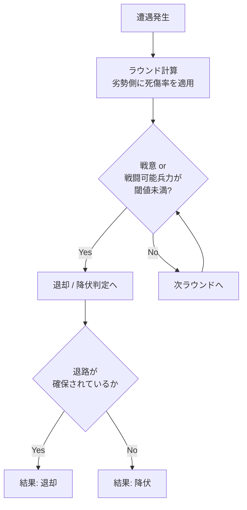
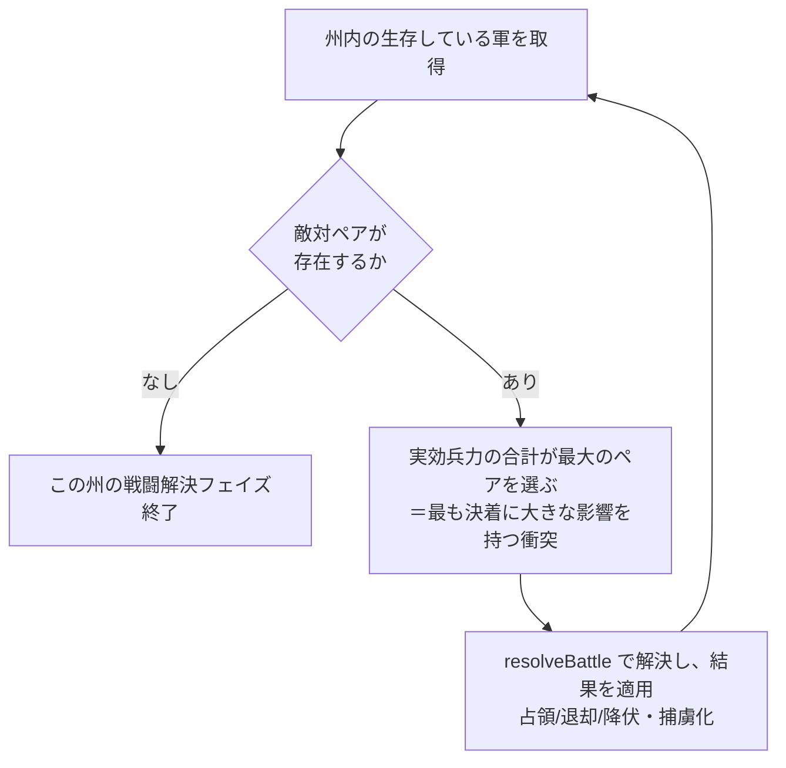
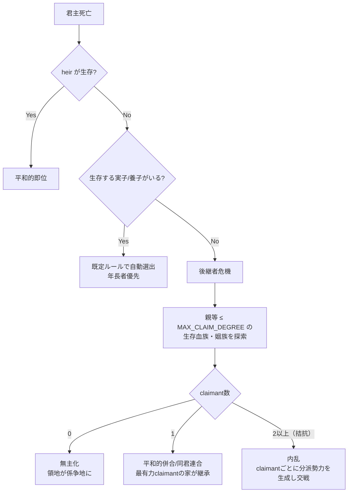
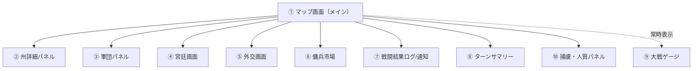
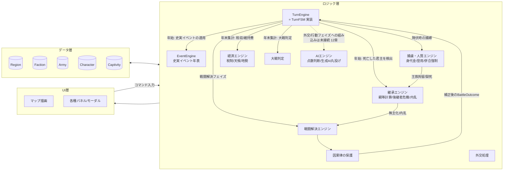

# ゲームシステム設計書（概要設計）

対象コンセプト: `gamesystem_europe.md`「会議は踊る、されど進まず」

本書は世界観・戦闘・勢力仕様（`gamesystem_europe.md`）を実装可能な粒度に落とし込んだ、
UI設計と処理（ゲームロジック）の概要設計である。局地戦の戦術描写は行わず、
戦闘はすべて演算で抽象化し、結果として **占領（領有）／退却／降伏** と
**人的・物的損耗** のみを提示する方針を貫く。

---

## 1. ゲーム全体構造

### 1.1 基本ループ

- 1ターン = 1年。神聖ローマ帝国成立（962年）からスタートし、大戦発生でゲーム終了。
- プレイヤーは1つの勢力（領主家 or 傭兵隊）を操作し、他勢力はAIが行動する。
- 各ターンは5フェイズの固定進行。全フェイズが終わると年が1つ進む。


| # | フェイズ | 内容 |
|---|---|---|
| ① 年始 | 疫病・宗教イベント抽選、出生/死亡・相続処理、経済更新の適用 |
| ② 外交 | 宣戦布告・同盟・婚姻協定・傭兵契約などの意思表示（プレイヤー入力＋AI解決） |
| ③ 行動 | 各キャラクター（君主／宰相／戦闘隊長）が年間アクションを1つ以上実行 |
| ④ 戦闘解決 | 同一州に敵対軍が存在する場合、抽象戦闘演算を実行し結果を確定 |
| ⑤ 年末集計 | 占領地確定、税収・維持費計算、大戦条件チェック、次年へ |

### 1.2 役職とアクション（`gamesystem_europe.md` 準拠）

| 役職 | 所属 | アクション |
|---|---|---|
| 君主 | 領主家 | 外交、宣戦布告、子作り、海外開発、婚姻（政略結婚）、**後継指定、養子縁組** |
| 宰相 | 領主家/傭兵団（経済担当） | 人材登用、外交、商業、税収管理 |
| 戦闘隊長 | 領主家/傭兵団 | 部隊編成、移動、戦闘、退却、略奪、人質売買 |

- 「後継指定」「養子縁組」は4章、人質売買（身代金交渉・人質提供）は5章で詳細を定義する。

- 1キャラクター＝1年に消費できる行動力（AP）は基本1〜2（役職ごとの上限をパラメータ化）。
- 領主家は宰相・戦闘隊長を複数人保有できる → 並列アクションが可能（同時に複数正面で外交/戦争を回せる）。
- 傭兵隊長は領地を持たず、雇用主から報酬・身代金・略奪で収入を得る。臣従はしない（契約満了/破棄が常に可能）。

---

## 2. データモデル（概要設計）

### 2.1 マップ／州（Region）

```jsonc
{
  "id": "region_burgundy",
  "name": "ブルゴーニュ",
  "owner": "faction_habsburg",
  "terrain": "plain",        // plain / hill / mountain / forest / coast
  "terrainModifier": { "attack": 1.0, "defense": 1.1 },
  "population": 120000,
  "taxBase": 800,
  "archetype": "continental", // 地勢アーキタイプ（10章）。基準税率係数に影響
  "garrison": { "count": 1500, "training": 0.6 }, // 常備兵（州直属）
  "adjacency": ["region_lorraine", "region_champagne", "region_franche_comte"],
  "fortified": false,        // true の場合は「持久戦（包囲）」ルールが適用
  "siege": null              // 包囲中なら { attacker, startTurn, supplyState }
}
```

### 2.2 勢力（Faction）

```jsonc
{
  "id": "faction_habsburg",
  "type": "lord",            // "lord"（領主）| "mercenary"（傭兵団）
  "ruler": "char_rudolf",
  "consort": "char_anna",
  "children": ["char_albrecht"],
  "heir": "char_albrecht",            // 後継指定（null なら死亡時に自動選出 or 後継者危機、4章参照）
  "chancellors": ["char_hans"],       // 宰相（複数可）
  "warlords": ["char_gottfried"],     // 戦闘隊長（複数可）
  "regions": ["region_burgundy", "region_swabia"],
  "treasury": 4200,
  "diplomacy": { "faction_valois": "war", "faction_wittelsbach": "alliance" },
  "atWar": true
}
```

### 2.3 軍団（Army）

```jsonc
{
  "id": "army_001",
  "faction": "faction_habsburg",
  "commander": "char_gottfried",     // 戦闘隊長。null なら指揮官なし（弱体化）
  "location": "region_lorraine",
  "units": [
    { "type": "pike", "count": 3000, "training": 0.7 },
    { "type": "cavalry", "count": 800, "training": 0.65 },
    { "type": "archer", "count": 500, "training": 0.5 }
  ],
  "doctrine": "swiss_pike",          // 戦術洗練度の元になる編成/時代要素
  "morale": 0.8,                     // 戦意（0〜1）
  "supply": 0.9                      // 補給状態。持久戦・移動距離で低下
}
```

### 2.4 人物（Character）

```jsonc
{
  "id": "char_gottfried",
  "name": "ゴットフリート",
  "role": "warlord",                 // ruler / chancellor / warlord / consort / heir
  "skill": { "command": 0.8, "diplomacy": 0.3, "administration": 0.2 },
  "traits": ["cavalry_specialist"],  // 指揮官特性 → 戦術洗練度補正
  "age": 34,
  "alive": true,
  "policy": "expansionism",           // 行動方針（9章）。史実で明確な人物以外は生成時に乱数割り当て
  "parents": ["char_wilhelm", "char_agnes"], // 実親（0〜2人。血族網・親等計算の起点）
  "children": [],                     // 実子
  "adoptedChildren": [],              // 養子（4.2）
  "adoptedBy": null                   // 自分が養子である場合、養親のID
}
```

### 2.5 捕虜・人質（Captivity）

```jsonc
{
  "captive": "char_lothair_jr",       // 捕らえられた人物
  "captor": "faction_habsburg",       // 捕らえた勢力
  "homeFaction": "faction_valois",    // 元の所属勢力
  "purpose": "war_captive",           // "war_captive"（戦争捕虜） | "political_hostage"（政治的人質）
  "capturedTurn": 12,
  "ransomDemand": 1200                // 政治的人質の場合は 0（金銭ではなく条約遵守が対価）
}
```

GameState はこれを `captivities`（`captive` の CharacterId をキーとするテーブル）として保持する。詳細は5章。

---

## 3. 戦闘解決システム（抽象演算）

局地戦画面には遷移しない。**同一州に敵対軍が同時に存在した瞬間に演算のみで決着する。**

### 3.1 戦闘力の算出

```
戦闘力(CP) = Σ(兵科ごとの 兵数 × 練度)
             × 戦術洗練度係数（時代ドクトリン）
             × 指揮官補正（有無・指揮能力・特性の噛み合わせ）
             × 状況補正（騎兵・弓兵の地形/兵科相性のみ。gamesystem_europe.md の
               「騎兵、弓でない限り軍の戦闘力で決まる」に対応し、槍兵・歩兵・砲兵は補正なし）
             × 地形係数（州の terrainModifier、攻撃側/防御側で別値）
             × 城塞防御補正（防御側かつ fortified の州のみ）
             × 士気係数 × 補給係数
```

- **戦術洗練度係数**：時代（スイス槍兵、イングランド長弓、ナポレオン式など）のドクトリンIDに紐づくテーブル値。
- **指揮官補正**：指揮官不在なら一律の不利補正。指揮官がいる場合は指揮能力（0〜1）による振れ幅に加え、
  指揮官特性が軍の主力兵科・状況と噛み合っていれば追加ボーナス（例：`infantry_specialist` が槍兵/歩兵主体の軍を率いる、
  `siege_specialist` が城塞化した州で防御する）。
- **状況補正（騎兵・弓兵のみ）**：
  - 騎兵：平地での突撃ボーナス、森林・山岳での悪路ペナルティ。敵の主力が槍兵、または州が城塞化（野戦築城含む）
    されている場合は突撃が阻まれ大幅減（「平地での騎兵突撃 vs 密集槍兵」の反転例）。敵の主力が砲兵の場合は
    展開前に蹴散らすボーナス。
  - 弓兵：基本のレンジ・アドバンテージを持つが、森林では視界・機動の制約で反転してペナルティになる
    （「森林での弓兵不利」の例）。敵の主力が騎兵かつ森林でない場合は、突撃を射抜く形でさらに大きなボーナス
    （クレシー/アジャンクール型の反転を表現）。
  - どちらの主力でもない場合（槍兵・歩兵・砲兵が主力）はこの補正は適用されない。
- **城塞防御補正**：城塞化された州（`fortified: true`）で防御する場合、兵科を問わず追加の防御ボーナスが乗る。
  攻城戦の陣地防御だけでなく、フス派のワゴンブルクのような野戦築城もこのフラグを流用して表現できる。
- **奇襲補正・挟撃補正**：戦闘解決エンジン自体は「奇襲/挟撃が成立しているか」の判定材料（隣接州の状況・
  複数方向からの同時侵入）を持たないため、判定はターンエンジン側の責務とし、成立時は真偽値として
  戦闘解決エンジンに渡す（初撃のみ有効な奇襲、全ラウンド有効な挟撃、という非対称性を持たせている）。

**駐留兵（`Region.garrison`）による防衛（実装済み：`turnEngine.ts` の `resolveGarrisonDefense`）**：
野戦軍（Army）とは別に、州は駐留兵という基礎防衛力を持つ（2.1章）。野戦軍同士の遭遇戦
（3.2章）が尽きたあとも敵対勢力の軍がその州に留まっている場合（＝領有勢力側の野戦軍が
不在／全滅済み）、駐留兵を一時的な防衛力（`phantomGarrisonArmy`、士気0.5の既定値）として
上記のCP式で戦わせる。これが無いと、駐留兵しか守っていない州へ野戦軍を進めるだけで
無血占領できてしまう（27勢力への拡張時にAIの行動フェイズを検証していて見つかった、
当初の実装漏れ——3.1〜3.2節の設計自体は当初から駐留兵を防衛力として想定していたが、
`runBattleResolution` が実際にそれを戦闘に組み込んでいなかった）。駐留兵はArmyエンティティ
としては永続化せず（州に固定された防衛力という位置づけを保つため）、占領されなければ
被害分だけ `Region.garrison.count` を直接減らす。

### 3.2 ラウンド処理（遭遇戦）

戦闘は抽象的な複数ラウンド（既定3ラウンド）で解決し、都度ログに要約を残す。



疑似コード：

```python
def resolve_battle(attacker: Army, defender: Army, region: Region) -> BattleResult:
    for round_n in range(MAX_ROUNDS):
        cp_a = combat_power(attacker, region, side="attack")
        cp_d = combat_power(defender, region, side="defense")
        ratio = cp_a / (cp_a + cp_d)

        casualties_d = defender.effective_strength * loss_rate(ratio)
        casualties_a = attacker.effective_strength * loss_rate(1 - ratio)
        apply_casualties(defender, casualties_d)
        apply_casualties(attacker, casualties_a)

        apply_morale_shock(defender, ratio)
        apply_morale_shock(attacker, 1 - ratio)

        loser = weaker_side(attacker, defender)
        # is_broken: 戦意が閾値未満、または「開戦時の兵数に対する現在の残存兵数の割合」が閾値未満。
        # 現在の effectiveStrength（練度加重兵数）を現在の兵数で割ると練度そのものに一致してしまい
        # 損耗を反映しない静的な指標になるため、必ず開戦時点の総兵数を基準に減少率を測る。
        if is_broken(loser):
            if has_escape_route(loser, region):
                return BattleResult.RETREAT(loser, casualties_a, casualties_d)
            else:
                return BattleResult.SURRENDER(loser, casualties_a, casualties_d)

    return BattleResult.INCONCLUSIVE(casualties_a, casualties_d)  # 双方消耗のみ、州は動かず
```

### 3.3 結果の3類型と後処理

| 結果 | 発生条件 | 後処理 |
|---|---|---|
| **占領（領有）** | 州の防衛側が野戦で敗北し降伏、または包囲（持久戦）が補給切れで陥落 | `region.owner` を勝者勢力へ更新。人口・税基盤に応じ略奪/接収の追加処理を実行可 |
| **退却** | 敗北側に退路（隣接する自勢力/中立地）がある | 敗走側は当該州から撤退、州の所有者は変わらない。双方の兵力・戦意は減少したまま次ターンへ |
| **降伏** | 敗北側に退路がない（包囲下・孤立） | 敗走側の軍は解体（捕虜化）。同行していた指揮官（戦闘隊長／同行中の君主・宰相）は `captivities` に捕虜として登録される（5章） |

### 3.4 持久戦（包囲）ルール

- 城塞化（`fortified: true`）された州は野戦一発では陥落せず、`siege` 状態に入る。
- 包囲中は毎ターン `supplyState` が減衰し、閾値割れで自動的に「降伏」判定。
- 解囲は、外部から援軍が到達し攻城側に対して野戦を仕掛け勝利すること。

### 3.5 損耗の抽象表現（UI表示用）

戦闘結果は以下の数値のみを提示し、個々の兵士描写は行わない。

- 死傷者数（攻撃側／防御側）
- 捕虜数（降伏時）
- 物資損耗（略奪発生時の税基盤・人口への影響）
- 戦意・練度の低下（次戦に影響する内部値。UI上はゲージ表示のみ）

### 3.6 検証プロセスと因果律の保護（実装済み）

冒頭で述べた検証プロセス（史実シナリオ化 → 係数調整 → それでも無理なら強制イベント）を、
実際にコード上の仕組みとして持たせている。

1. **史実シナリオ検証**：クレシー/アジャンクール型（寡兵の長弓兵が仏騎兵を破る）、スイス槍兵型
   （密集槍兵が数的優位の騎兵突撃を跳ね返す）、フス戦争型（ワゴンブルクに拠る寡兵が十字軍を破る）、
   ナポレオン式軍団型（戦術洗練度が兵力差を覆す）、指揮官の有無・技量の効果、そして「圧倒的な物量は
   精鋭の戦術的優位を覆しうる」という数の暴力の効き目確認まで、`combatEngine.historical.test.ts` で
   一連の史実シナリオをテストとして固定し、係数を変更するたびに再演算・回帰確認する。
2. **因果律の保護（Causality Guard）**：`causalityGuard.ts` に、係数調整だけでは再現できない史実の
   転換点を戦闘演算の外側から明示的に補正する仕組みを用意している。既定では登録されたガードは1つも
   なく、`scenarioTag`（呼び出し側が付与するシナリオ識別子）と対象ターンに紐づく形でのみ発火し、
   適用結果は必ずログに残る。汎用の勝率操作としては使わず、あくまで「この局面は定説上ほぼ確実に
   こうなったはず」という特定の史実イベント用の最終手段と位置づける。

### 3.7 同一州での多重戦闘・奇襲・挟撃の判定（実装済み）

3.1節の状況補正のうち、単独のペア（攻撃側/防御側の2軍）を前提にした演算だけでは扱えない
3点を、TurnEngine（8章）側の具体的なアルゴリズムとして定義する。

**多重戦闘（同一州に3勢力以上の敵対軍が同時に存在する場合）**

TurnEngineの戦闘解決フェイズは、州ごとに次のループで解決する（`turnEngine.ts` の
`runBattleResolution`）。



1. その州にいる軍の中から、互いに戦争状態にある勢力の軍のペアを全て列挙する。
2. ペアが1つも無ければ終了。
3. 複数ペアがある場合、両軍の実効兵力の合計が最大のペアを選び、`resolveBattle` で解決する。
4. 結果（占領・退却・降伏・捕虜化）を適用する。
5. 州に残っている軍で1に戻る。

この方式なら、A・B・Cの3勢力が同じ州に居合わせても、まず最大の衝突が解決され、生き残った軍と
残る敵対勢力との間で次の戦闘が続く、という自然な逐次処理になる。「1ターンに同一州で何回まで
戦えるか」の明示的な上限は設けていないが、練度0の軍同士など極端な入力で決着がつかず無限ループに
陥ることを防ぐ安全弁（`MAX_ENCOUNTERS_PER_REGION`、既定20）を設けている。

**奇襲補正の判定条件**

「隣接州に敵の優秀な指揮官がいて先制条件を満たす場合」を、次の具体的な条件として実装する
（`detectSurprise`）。

> 奇襲成立 = 攻撃側と同じ勢力の別の軍が、戦場に隣接する州に駐留しており、
> その軍の指揮官の指揮能力が閾値（既定0.7）以上である

「側面の州に構える有能な指揮官が、事前に敵情を探って攻撃のタイミングを整えた」という状況を、
既存のデータ（軍の所在州・指揮官の指揮能力）だけで判定できるようにしたもの。奇襲は初撃
（1ラウンド目）のみ有効（3.1節の `SURPRISE_BONUS`）。

**挟撃補正の判定条件**

「複数方向から同時侵入した味方軍がいる場合」を、次の条件として実装する（`detectFlanking`）。

> 挟撃成立 = 攻撃側と同じ勢力の別の軍（1隊以上）が、この戦闘が起きている州そのものに
> 同時に所在している

同じ州に攻撃側の軍が2部隊以上同時に進軍してきた場合（＝別々の方面から同時に侵入した扱い）、
戦闘解決の対象になっている軍に恒常的な挟撃ボーナスが乗る。挟撃は奇襲と異なり全ラウンドを
通じて有効（複数部隊が最後まで包囲網を維持し続けるため）。なお、この判定は攻撃側にのみ適用する
（防御側は自国領内で複数部隊を持っていても「挟撃」にはならない、待ち構えているだけのため）。

---

## 4. 継承・養子・内乱システム

`gamesystem_europe.md` が想定する「宗教・疫病に次いで歴史に大きな影響を及ぼすもの」として、
本書では**後継者危機**を明示的にモデル化する。大戦以外の紛争の多くは、領土紛争そのものよりも
「跡目が絶えた・拮抗した」ことに起因する内乱として発生させる。

### 4.1 血族ネットワークと親等

- `Character` は実親 `parents`（0〜2人）、実子 `children`、養子 `adoptedChildren`、
  自分が養子である場合の養親 `adoptedBy` を持つ（2.4節）。
- **親等**は「親子」「配偶者」を各1辺とする無向グラフ上の最短距離として簡略化して算出する
  （カノン法の傍系換算を厳密に再現するものではなく、ゲーム的な近さの指標）。配偶者経由の姻族も
  同じ重み1辺で距離に含める。

```
function kinshipDegree(a, b, characters):
    # parents/children/spouse を辺とする無向グラフ上の BFS 最短距離
    # 例: 本人 → 父 → 祖父 → 伯父 → 従兄弟 = 4親等相当
    ...
```

### 4.2 後継指定と養子縁組

- 君主コマンド「**後継指定**」：実子・養子の中から後継者を選び `faction.heir` に設定する。
  未指定のまま君主が死亡した場合は、既定ルール（年長者優先、次点で能力優先）で自動選出する。
- 君主コマンド「**養子を迎える**」：**実子・養子いずれの後継候補もいない場合にのみ実行可能。**
  親等 `ADOPTION_MAX_DEGREE`（既定値5、パラメータ化）以内の親族の子を対象に選定し、
  自家の `adoptedChildren` に加えたうえで即座に `heir` へ指定できる。
  - 他家（他の領主家）の子を養子にする場合は、相手家との外交合意が必要（婚姻協定と同様、
    外交フェイズのコマンドとして処理し、関係値に影響する）。
  - 傭兵団（`type: mercenary`）は家系を持たないため、この一連のコマンドの対象外。

### 4.3 後継者不在時の処理（後継者危機）

君主の死亡（老衰・戦死・疫病など、複数人が同一年に一挙に死亡するケースを含む）を年末集計フェイズで検出し、以下の優先順位で解決する。



- `MAX_CLAIM_DEGREE`（既定値: 8〜10程度、要バランス調整）：これを超える血縁・姻戚関係は
  王権主張の対象外とする。「相当遡った分家筋や姻戚の他王家」を拾えるよう、養子縁組の
  `ADOPTION_MAX_DEGREE` より意図的に広く取る。
- claimant の主張の強さは `1 / (親等 + 1)` を基本値とし、claimant自身が所属する勢力の
  国力（軍事力・財力）で補正する。上位の主張が突出していれば「1」扱い（拮抗なし）。
- **無主化**：claimantが1人もいない場合、当該勢力は消滅し、所有していた州は
  owner未定の係争地（`interregnum`）になる。隣接勢力は駐留戦力を既定の抵抗値として、
  通常の占領手順（3章）で無血に近い形で接収できる。
- **平和的併合／同君連合**：唯一の有力claimantが他家の当主である場合、戦闘を経ずに
  当該勢力の州がclaimant側の勢力に編入される（完全併合か同君連合として別勢力のまま
  外交関係だけ従属化するかは、実装時にパラメータ化する）。
- **内乱**：主張の強さが拮抗する複数claimantがいる場合、元勢力の州・軍団をclaimantごとに
  分割した「分派勢力（claimant faction）」を一時的に生成し、3章の戦闘解決システムで
  決着がつくまで争わせる。最終的に旧勢力の全州を制した分派が正式な後継勢力として確定する。

> 世界観メモ：宗教・疫病と並び、この後継者危機は史実の紛争の多くを占める発生源として扱う。
> 5章の捕虜・人質システム（特に君主・後継者の捕縛）は、この後継者危機を意図的に誘発する
> 手段にもなる（5.4節）。

### 4.4 死亡・出生（実装済み・仮実装、ユーザー報告により発覚した欠落への対応）

上記4.1〜4.3の継承システムは実装として完成していたが、ユーザーが300ターン級のプレイを
重ねても後継者危機や皇帝の代替わりが一度も発生しないと報告し、調査の結果
**`Character.alive` を `false` にする仕組みがゲーム中に一つも無かった**ことが判明した
（戦闘での指揮官死亡・捕虜の獄死も含め、死亡そのものを判定するロジックが存在しなかった）。
継承システムは「死亡」というトリガーが無ければ一生発火しない。

婚姻システム（12章、今後の課題）の本格実装を待たず、以下を年末集計フェイズの仮実装として
追加した（`turnEngine.ts`）：

- **死亡**（`ageAndRollMortality`）：生存する全キャラクターを毎年1歳加齢させ、年齢に応じた
  確率（`mortalityProbability`：40歳未満はほぼ死なず、80歳を超えると年20%まで上昇する
  仮の死亡曲線）でロールする。
- **出生**（`rollChildbirths`）：出産適齢（16〜45歳、仮値）の当主（`role: "ruler"`）に、
  年15%（仮値）の確率で子（`role: "heir"`）が生まれる。当初は「配偶者がいること」も
  条件にしたが、初代の当主は既に配偶者持ちで開始する一方、跡を継いだ2代目以降は
  婚姻を経る手段が無く配偶者を持てないため、1世代で血筋が途絶えることが
  シミュレーションで判明した。婚姻を経ずに当主本人の年齢だけを条件にする形へ簡略化し、
  配偶者は `parents` に含めない（単親記録。婚姻システム実装時に置き換える前提の割り切り）。

> **既知の課題（要継続バランス調整）**：出生を追加した後も、1000年シミュレーションで
> 神聖ローマ帝国「本体」14勢力（4.5章）の大半が数十〜100年程度で後継者不在により
> 断絶することを確認している（1回のみの当主による単系統の再生産という制約上、
> 現在の死亡率に対して出生率がなお不足気味）。断絶そのものは「専制君主の秩序が
> ほころびていく」というユーザーの企図したテーマに沿う面もあるが、ペースとしては
> 急すぎる可能性が高く、係数の継続調整、あるいは婚姻システム本格実装（複数の
> 血族が独立に子をもうけられるようにする等）で改善する見込み。

### 4.5 神聖ローマ皇帝の称号（実装済み、ユーザー要望）

「そもそもの企画がハプスブルクの守った専制君主による秩序の隆盛・停滞・ほころび・終焉を
描きたい」というコンセプトに対し、962年開始時点でオットー1世（＝当時の`faction_hre`）が
戴冠していた実態と、いずれハプスブルク家（`faction_austria`）が史実どおり戴冠しうる
流動性を両立させる必要がある。これを実現するため、「神聖ローマ帝国」という呼称を
特定の家系に固定しないよう設計を変更した：

- `faction_hre` の表示名は他の選帝侯家と同格の「ザクセン選帝侯領」に変更した
  （ID・領地・人物データは変更なし）。
- 帝位そのものは `GameState.imperialTitle`（`models/imperialTitle.ts`）として独立管理する。
  962年の初期状態でオットー1世（`faction_hre`）が保持した状態で開始する（史実どおり）。

**継承ルール**（`turnEngine.ts` の `advanceImperialTitle`）：帝位保持者の家系（勢力）が
存続する限り、帝位はそのまま——「元帝の嫡出子が優先される」というユーザー要望のルールは、
既存の継承システム（`resolveSuccession` が `Faction.heir` を優先する）にそのまま委ねる形で
実現している：帝位保持者の勢力が同じ家系のまま存続すれば、それだけで「嫡出子（後継者）が
継いだ」ことになるため、改めて判定する必要が無い。保持者の勢力が滅亡・解体（後継者危機で
継ぐ者がいなかった場合を含む）、または誰かに服属した場合にのみ、選帝侯による選挙
（`electImperialTitle`）を行う。空位（該当者なし）の間は、埋まる候補が現れるまで毎年
選挙を試み続ける。

**選挙ルール**（ユーザー提示の史実再現ロジックをそのまま採用）、優先順位：

1. 選帝侯7家（`HRE_ELECTOR_FACTION_IDS`：ザクセン＝`faction_hre`・マインツ・トリーア・
   ケルン・プファルツ・ブランデンブルク・ボヘミア。金印勅書〈1356年〉の史実7選帝侯に対応）
   のうち、同盟関係にある家の数が最も多い候補を選ぶ（＝選帝侯からの支持が厚い候補）。
2. 同数なら、経済力（`factionEconomicStrength`）に対して軍事力（`factionMilitaryStrength`）
   が小さい候補を優先する——「賄賂を贈れて、選帝侯自身の脅威にならない」候補ほど選ばれる
   というユーザーの指摘どおり、史実でルドルフ1世（当時は選帝侯ですらない一領主）が
   選ばれた事情を再現する狙い。
3. 教皇領と交戦中の候補は除外する。

候補者プールは帝国本体14勢力（`HRE_CORE_FACTION_IDS`、15章）——史実のルドルフ1世同様、
選帝侯自身である必要はない。服属中（`suzerain !== null`）の勢力も、独立して立てる主体では
ないため除外する。

**帝位の特典**（ユーザー要望）：

- 保持者は毎年、通常の税収に加えて帝国税収ボーナス（`IMPERIAL_TITLE_TAX_BONUS`、仮値）を
  国庫に得る（`runYearEnd`）。
- 皇帝への大義なき開戦（宣戦布告・同盟破棄からの開戦）は、正当性（legitimacy）・安全性
  （safety、他の諸侯の介入を招く政治的リスクとして表現）の両スコアを下げる
  （`buildDiplomaticOptions`）。あくまで穏やかなバイアスであり絶対的な禁止ではない
  ——史実でも皇帝への反乱・帝国追放（Reichsacht）は起きている。軍事的に圧倒的優位、
  または元々expansionism寄りの勢力であれば、この程度のバイアスは押し切って開戦しうる
  （意図的にそう設計している）。

> **既知の簡略化**：経済力・軍事力は現在値の比較に留まり、真の成長率トレンドは追っていない
> （大国キャンペーンAI・13.5章と同じ制約）。選挙自体は選帝侯7家＋帝国本体14勢力という
> 固定リストに基づくため、拡張マップ（12章・15.7章）で新たな勢力を追加する場合は
> このリストの見直しが必要になる。

---

## 5. 捕虜・人質システム

### 5.1 捕虜の発生

- 3章の戦闘解決で**降伏**判定になった側の指揮官（戦闘隊長、または同行していた君主・宰相）が
  捕縛対象になる。捕虜になるかは「指揮官の有無」と「退路の有無」で決まり、`BattleOutcome` に
  `capturedCommander` として記録される。
- 捕虜は2.5節の `captivities` テーブルで管理し、`captor`（捕らえた勢力）・`homeFaction`（元の
  所属勢力）・`purpose`（`war_captive` 戦争捕虜 / `political_hostage` 政治的人質）を持つ。

### 5.2 身代金交渉（傭兵経済との連動）

- 捕虜が `war_captive` の場合、捕らえた勢力は外交フェイズで身代金を要求できる。
- 元の勢力（傭兵団出身者の場合は本人の資産）が支払えば釈放。支払わなければ拘留が続き、
  低確率で獄死イベントが発生する（獄死した捕虜が後継者だった場合、4章の後継者危機に直結する）。
- 傭兵隊長が捕虜になった場合、雇い主に身代金の支払い義務はない（非臣従契約のため）。
  捕らえた側は身代金の代わりに「寝返らせて自軍の戦闘隊長として登用する」選択肢を持つ。
  これが傭兵経済のもう一つの入口になる（人材登用コマンドの捕虜版）。
- **食い詰めた際の略奪（実装済み、ユーザー要望）**：契約（雇用交渉）によるAI自動収入は
  まだ未実装（12章）のため、傭兵団（`type: "mercenary"`）は領地を持たず（課税対象が無く）
  身代金以外の恒常収入源が無い。放置すると国庫が維持費（`armyUpkeep`）で先細るだけになって
  しまうため、国庫が維持費のおよそ3年分を下回ると（`isMercenaryStarving`）、交戦状態の
  有無を問わず現在地や隣接州を略奪目的で襲う（`buildActionOptions`）——「食い詰めれば
  周辺を荒らし回る暴力集団」という傭兵団の性格を、契約経済が実装されるまでの
  フォールバックとして表現する。既知の簡略化として、この略奪的な襲撃は正式な戦争状態を
  経ないため、現状の戦闘解決フェイズ（3.7章、`war` 状態の勢力ペアのみを検出する）では
  被害者側の軍・駐留兵からの反撃は発生しない（略奪の成否は常に成功する）。

### 5.3 政治的人質（服属・傀儡化の担保）

- 和平交渉・服属化（`diplomacy: "vassal"`）の条約条件として、敗戦側が自家の子女を人質として
  差し出す外交コマンド「人質を差し出す」を用意する。
- 人質の在留中に条約を破棄（再宣戦など）すると、人質の処遇イベント（処刑・返還など）が
  発生し、破棄した側は関係値・対外評判に大きなペナルティを受ける。

### 5.4 併合・傀儡化への活用

- 敵勢力の君主・後継者（`heir`）を含む王族の大半が捕虜になった場合、捕らえた勢力は
  外交フェイズで「併合を強制」または「傀儡化（`vassal`）を強制」コマンドを行使できる
  （通常の外交合意なしで一方的に発動可能）。
- 捕虜になった君主がそのまま拘留中に死亡すると、当該勢力は4.3節の後継者不在に陥りやすくなり、
  係争地化・内乱の引き金にもなる。捕虜戦略と継承システムが意図的に連動する設計とする。

---

## 6. ゲームオーバー

「世界のゲームオーバー」（大戦、6.1）と「プレイヤーのゲームオーバー」（6.2）の2種類がある。
前者はゲーム世界そのものの終了、後者はプレイヤー個人の勢力の終了であり、後者が発生しても
世界（他の勢力の歴史）は続く場合がある（傍観モード）。

### 6.1 世界のゲームオーバー（大戦判定、実装済み：`warCheck.ts`）

- 年末集計フェイズで、全生存勢力のうち `atWar == true` の割合を算出。
- 割合が **2/3以上** に達した瞬間、大戦が発生しゲーム終了。参戦の有無に関わらず全生存勢力が
  敗北扱い（`GameState.greatWarTriggered`）。
- UI常時表示の「大戦ゲージ」で現在の戦争状態勢力比率を可視化し、プレイヤーに警告する。
- `greatWarProximity(state)`（0〜1、`warCheck.ts`）は `war_ratio` を閾値2/3で正規化した
  「大戦への近さ」。AIの意思決定（9章・13章）に必ず織り込む前提値として使う。
- 臣従（vassal）した勢力は、独立して交戦を続ける主体ではないため `atWar` のカウントから
  除外する（ユーザー報告により発見：服属前の古い「戦争」ステータスが `diplomacy` に残った
  まま数えられ続け、無関係な2勢力が開戦→大戦回避ストッパーに阻まれて和平→また開戦、を
  繰り返す誤作動の原因になっていた）。
- **最低勢力数（`GREAT_WAR_MIN_ALIVE_FACTIONS`＝6、実装済み・仮値）**：生存勢力数がこれを
  下回る場合、比率が2/3を超えていても大戦は発生しない。「大戦」は多数の独立勢力が
  並び立つ多極的な世界を前提にした概念であるべき、という考え方に基づく。4.4章の
  死亡・出生の仮実装を追加した後、後継者不在の断絶や征服による自然な淘汰で世界が
  数勢力にまで集約された局面で、残り2〜3勢力が交戦しただけの局地紛争が「世界大戦」として
  誤発生することを実際のシミュレーションで確認し、追加した。

```
war_ratio = count(faction.alive && faction.suzerain == null && faction.atWar) / count(faction.alive == true)
if count(faction.alive == true) >= GREAT_WAR_MIN_ALIVE_FACTIONS and war_ratio >= 2/3:
    trigger_great_war_ending()  # 参戦国すべて敗北

great_war_proximity = min(1, war_ratio / (2/3))  # AIの意思決定に必ず渡す
```

### 6.2 プレイヤーのゲームオーバー（実装済み：`playerGameOver.ts`）

プレイヤーの勢力（`GameState.playerFactionId`）に起きるゲームオーバーは、原因によって
「そのまま終了」以外の選択肢が用意される。世界のゲームオーバーとは異なり、
プレイヤー個人の物語の終わり方であり、世界全体は続いていく（＝他の勢力の歴史を
「傍観」できる）のがポイント。

#### 6.2.1 降伏／降参／臣従（capitulation）

以下のいずれかが起きると成立する：

- **降伏／降参**：敗退時に退却先の州がない（`combatEngine.ts` の `findEscapeRegion` が
  見つからず、軍が現地で壊滅する）。最終的に州も軍団も失った状態
  （`Faction.regions.length === 0` かつ自勢力の軍団が存在しない）。
- **臣従**：捕虜・人質を介した服属強制（5.4章、`captivity.ts` の `forceVassalization`）を
  受けた状態。このとき `Faction.suzerain` に相手勢力のIDが設定される
  （`diplomacy` の対称な `"vassal"` マーカーだけでは「どちらが宗主か」が分からないため、
  `suzerain` が一意の向きを持つ）。

プレイヤーへの提示：

1. **そのまま終了**。
2. **傍観モードに入る**（`enterSpectatorMode`）：併合先／宗主勢力（`SpectatorState.hostFactionId`）
   の視点で、以降の歴史の展開を見続けられる。ゲーム的な妥協案のつもりで用意したが、
   実際に実装してみると「敗れた王侯貴族が勝者の宮廷に仕える／人質として留め置かれる」という
   史実の質感に近く、単なる代替手段以上の意味を持つ。
   - 傍観中にホスト勢力が**後継者なし・滅亡**した場合、「再起チャンス」が生まれる
     （`checkComebackOpportunity`）。元の勢力がまだ存在していれば、宗主の空位に乗じて
     独立を回復できる（`reclaimIndependence`：`suzerain` を解除し、外交関係を和平に戻す）。
   - 傍観をあきらめて終了することもできる（`giveUpSpectating`）。

#### 6.2.2 滅亡（annihilation）

戦闘で一族（勢力に所属する全人物）が全滅した状態。`evaluatePlayerGameOver` は、
その勢力に所属していた人物が1人以上存在し、その全員が死亡していることをもって判定する。

プレイヤーへの提示：

1. **そのまま終了**。
2. **姻戚関係にある最も血縁の近い、現存する他家当主として再開する**
   （`findClosestSurvivingRuler`/`restartAsClosestKin`）。滅亡した家系の全メンバーを起点に
   4章の血族ネットワークBFS（`kinship.ts` の `findWithinDegree`）を実行し、現存する
   当主（`role: "ruler"` かつ `Faction.ruler` が本人）の中で最も親等の近い人物を探す。
   該当者がいない場合はこの選択肢自体が提示されない（そのまま終了のみ）。

```
evaluate_player_game_over(state):
  if playerFactionId is null: return none
  faction = factions[playerFactionId]
  members = characters where character.faction == playerFactionId
  if members is not empty and all(not member.alive for member in members):
      return annihilation
  if faction.alive and faction.suzerain is not null:
      return capitulation(reason=vassalized)
  if (not faction.alive or (faction.regions is empty and no armies)) and faction.suzerain is null:
      return capitulation(reason=surrender)
  return none
```

---

## 7. UI設計

### 7.1 画面構成



| # | 画面 | 目的 | 主要UI要素 |
|---|---|---|---|
| ① マップ画面 | 全体状況把握・メイン操作起点 | 州ごとの勢力色分け、軍団アイコン、州クリックで②起動、右上に⑨大戦ゲージ常設。無主化した係争地は網掛け表示 |
| ② 州詳細パネル | 州単位の情報確認・命令 | 州名/領有者/人口/税基盤/駐留戦力/地形/隣接州リスト、包囲中は補給ゲージ |
| ③ 軍団パネル | 軍の編成・命令 | 兵科構成、練度・戦意ゲージ、指揮官、コマンドボタン（移動／攻撃／退却／略奪／解散） |
| ④ 宮廷画面 | 人物・家系管理 | 家系図、婚姻コマンド、**後継指定**、**養子を迎える**（後継候補ゼロの時のみ活性化）、宰相・戦闘隊長の一覧と登用/罷免 |
| ⑤ 外交画面 | 対外関係操作 | 勢力別関係値、宣戦布告／同盟／和平／婚姻協定ボタン、**人質を差し出す**、（王族捕虜多数時のみ）**併合を強制／傀儡化を強制** |
| ⑥ 傭兵市場 | 傭兵団の雇用 | 傭兵団一覧（戦力・戦術傾向・契約金）、雇用コマンド |
| ⑦ 戦闘結果ログ | 戦闘の事後報告 | 州名・勝敗・結果種別（占領/退却/降伏）・死傷者数・捕虜数・捕縛した指揮官名をリスト表示（テキスト主体、演出無し） |
| ⑧ ターンサマリー | 年始イベント通知 | 疫病発生、後継者誕生/死亡、**後継者危機（内乱/無主化/同君連合）**、宗教改革などのイベントカード |
| ⑨ 大戦ゲージ | 常時警告表示 | 戦争状態勢力比率のプログレスバー、2/3到達で警告色 |
| ⑩ 捕虜・人質パネル | 捕虜・人質の管理 | 自勢力が捕らえた/捕らえられた人物一覧、身代金要求/支払い、寝返らせて登用、人質の処遇状況 |

### 7.2 画面遷移とモーダル方針

- 戦闘結果は**画面遷移せずモーダル/サイドパネルで完結**（局地戦画面は作らない）。
- ターン進行は「行動フェイズ終了」ボタンで確定 → ④戦闘解決 → ⑤集計 が自動実行され、結果は⑦⑧に集約されて提示。年末集計で後継者危機が発生した場合も⑧に集約する。
- プレイヤーの役職別ビュー切り替え（君主／宰相／戦闘隊長）をマップ画面上部タブで提供し、それぞれの担当コマンドのみをハイライト。

### 7.3 州詳細パネルのワイヤーフレーム（テキスト表現）

```
┌──────────────────────────────┐
│ ブルゴーニュ                    │
│ 領有: ハプスブルク家              │
│ 人口: 120,000  税基盤: 800       │
│ 地形: 平地  城塞: なし            │
│ 駐留戦力: 1,500 (練度 60%)        │
│ ─────────────────────────── │
│ 隣接: ロレーヌ / シャンパーニュ / …  │
│ ─────────────────────────── │
│ [ 軍団を送る ] [ 開発する ] [ 閉じる ]│
└──────────────────────────────┘
```

### 7.4 戦闘結果ログのワイヤーフレーム

```
┌──────────────────────────────┐
│ 1523年 戦闘結果                 │
│ ─────────────────────────── │
│ ロレーヌ：ハプスブルク軍 勝利         │
│  結果: 占領                     │
│  死傷者: 味方 320 / 敵 1,150      │
│  捕虜: 400（敵将ジャン・ド・ヴァロワ含む）│
│ ─────────────────────────── │
│ シャンパーニュ：ヴァロワ軍 退却        │
│  死傷者: 味方 210 / 敵 480       │
└──────────────────────────────┘
```

### 7.5 捕虜・人質パネルのワイヤーフレーム

```
┌──────────────────────────────┐
│ 捕虜・人質                       │
│ ─────────────────────────── │
│ ジャン・ド・ヴァロワ（ヴァロワ家 戦闘隊長）│
│  区分: 戦争捕虜  拘留: 3年目          │
│  [ 身代金を要求 (800) ] [ 登用交渉 ]  │
│ ─────────────────────────── │
│ アンヌ王女（ヴァロワ家 人質）          │
│  区分: 政治的人質（服属条約の担保）      │
│  条約破棄時: 処遇イベント発生 [ 詳細 ]  │
└──────────────────────────────┘
```

### 7.6 後継者危機のターンサマリー表示

年始フェイズで後継者危機を検出した場合、8章の SuccessionEngine が確定した結果種別
（平和的即位／自動選出／同君連合／内乱／無主化）をイベントカードとして⑧ターンサマリーに
表示する。内乱発生時は分派勢力の色分けをマップ上に即座に反映する。

```
┌──────────────────────────────┐
│ 後継者危機 — ヴァロワ家             │
│ ─────────────────────────── │
│ 君主ロテール2世が跡継ぎなく死去した。     │
│ 拮抗する2つのclaimantが現れ、内乱に突入する。│
│  ・ブルゴーニュ分家（親等3）           │
│  ・ハプスブルク家（親等6・姻戚）        │
│ [ 詳細を見る ]                    │
└──────────────────────────────┘
```

### 7.7 天候・イベントの視覚表現

~1000ターンに及ぶゲームで毎年つぶさに文章を読ませるのは負担が大きいため、天候・イベントは
「一目で状態が分かる」ことを優先し、テキストではなくアイコン・色・背景で表現する。
テキストによる詳細は、州詳細パネル（7.3）やターンサマリー（7.6）を開いたときの
セカンダリ情報として残す。

**天候（州ごと、`economy.ts` の `weatherVisualCategory`）**：
`rollWeatherFactor` が返す天候係数を3カテゴリに分類し、マップ上の州タイルの背景色・
小アイコンにそのまま対応させる（経済側の凶作/豊作判定と同じしきい値を使うため、
表示と実際の税収変動が常に一致する）。

| カテゴリ | 係数の範囲 | 州タイルの表現 |
|---|---|---|
| harsh（凶作） | < 0.8 | 州タイルを黄土色〜褐色に沈める。小さな枯れ穂アイコン。 |
| normal（平年） | 0.8〜1.2 | 通常の地勢アーキタイプ配色のまま、天候アイコンなし。 |
| bountiful（豊作） | > 1.2 | 州タイルにわずかな金色のハイライト。小さな豊穣アイコン。 |

**戦争・包囲状態（州ごと）**：州タイルの縁取り色で表現する（赤＝戦争中の勢力が領有、
オレンジの点滅縁＝包囲中）。因果律の保護（3.6章）が発動した州は、次のターンサマリーが
閉じられるまで金色の縁取りで強調する。

**版図外勢力の襲来（13章）**：被災した辺境州（`Region.frontier`）を、天候とは別レイヤーの
炎・髑髏アイコンで数ターンの間オーバーレイ表示する。史実イベント年表（11章）の発生時も
同様に、影響を受けた州へ小アイコン（黒死病＝髑髏、戦争勃発＝交差剣、など）を数ターン重ねる。

**大戦への近さ（6.1章）**：画面上部の常設「大戦ゲージ」が `greatWarProximity` を
0〜100%のバーで表示し、閾値（2/3）に近づくほど配色を緑→黄→赤へ遷移させる。
マップ全体の背景トーンも、大戦への近さが高いほどわずかに赤みを帯びさせ、
「盤面全体が緊迫していく」感覚を演出する。

---

## 8. 処理アーキテクチャ（概要）



- **TurnEngine**（`src/engine/turnEngine.ts`、実装済み）：本書 1.1 の5フェイズを管理する有限状態機械（TurnFSM）の実体。
  `runPhase` が現在のフェイズを1つ処理して次のフェイズへ進め、`advanceYear` が1年分（次の年始フェイズに戻るまで）を
  通して処理する。年始フェイズで死亡した君主を検出してSuccessionEngineへ・史実イベントをEventEngineへ、
  戦闘解決フェイズで同一州の敵対軍を検出してCombatEngine→CausalityGuardへ、年末集計フェイズで
  EconomyEngine（税収・維持費）とWarCheckへ、それぞれ処理を委譲し、結果（占領による領有権移動、退却による
  軍の移動、捕虜の発生、後継者危機の帰結、国庫の増減、大戦の発生）を GameState に反映する。
  外交・行動フェイズは、AIエンジンが実装済みであるにもかかわらず未接続のため現状フェイズを進めるだけの
  スタブ（12章）。乱数源（天候抽選等）・因果律の保護・有効な史実イベントは、いずれも `TurnEngineOptions`
  として `runPhase`/`advanceYear` に注入できる。
- **CombatEngine**：3章の演算を実装。入力＝両軍のArmy/Region/指揮官、出力＝BattleOutcome（結果種別＋損耗値＋
  捕縛した指揮官＋退却した側）。史実シナリオでの検証結果は3.6節を参照。多重戦闘・奇襲・挟撃の判定は3.7節。
- **CausalityGuard**：3.6節の「因果律の保護」。TurnEngineがCombatEngineの出力を状態に反映する直前に通す。
- **EventEngine**：11章の史実イベント年表の抽選と適用（実装済み）。局地的な疫病・宗教イベントの
  ランダム抽選は未実装（12章）。
- **SuccessionEngine**：4章の親等計算・後継指定・養子縁組・後継者危機（無主化/同君連合/内乱への分岐）を担う。内乱時はCombatEngineに分派勢力同士の戦闘解決を委譲する。
- **CaptivityEngine**：5章の捕虜発生・身代金交渉・登用・政治的人質・併合/傀儡化の強制を担う。王族の拘留・獄死はSuccessionEngineに通知し後継者危機の引き金になりうる。
- **AIエンジン**：9章の点数判断（`aiPolicy.ts`）・生成AI丸投げ（`aiProvider.ts`）。実装済みだが、
  TurnEngineの外交・行動フェイズにはまだ接続されていない（12章）。
- **経済エンジン**：10章の税制・天候・地勢。`economy.ts` として実装済み、TurnEngineの年末集計フェイズから呼ばれる。
- **WarCheck**：年末集計フェイズで大戦条件を評価し、該当時はゲーム終了処理を呼ぶ。
- UI層はロジック層が確定した状態のみを描画するイミュータブルな一方向データフローとし、演出的なアニメーションは持たない（仕様上「結果だけ表示」のため）。

### 8.1 実装方針（参考）

- Web SPA（例：TypeScript + React or Vue）＋ SVGベースの州マップを想定。州ポリゴンはGeoJSON等で管理し、州IDでデータ層と紐付け。
- ロジック層はUIから独立した純粋関数群として実装し、後日CLI/バッチでのバランス検証やAI思考ルーチンのテストを容易にする。
- セーブデータは State（Regions/Factions/Armies/Characters + 現在ターン数）のスナップショットとして永続化。

### 8.2 ローカルPoCハーネス（実装済み：`server/`）

上記の本格的なWeb SPAはまだ実装していないが、ロジック層（`src/`）が最初からUIから独立した
純粋関数群であるおかげで、動作確認用の薄いハーネスを別途用意できた。`server/index.mjs`
（Express、GameStateはプロセスメモリ上に1つだけ）が `src/` のビルド済みエンジンをHTTP API
として公開し、`server/public/`（プレーンHTML/CSS/JS、7章のUIモックアップと同じ配色・
フォントを踏襲）がそれを叩いて州・勢力・軍団・年表ログを描画する。認証・永続化・複数セッション
対応を持たない、ローカル単独プレイのPoC限定の構成であり、本節が想定する本格実装
（GeoJSON州ポリゴン地図・状態管理を伴うSPA）への置き換えを前提とする（12章）。

---

## 9. AI意思決定システム

各勢力（特に君主・戦闘隊長・宰相）の行動を、史実に基づく、あるいは記録が乏しい人物には
一貫した「方針」に基づいて決定させる仕組み。`aiPolicy.ts`（点数判断）・`aiProvider.ts`
（生成AI丸投げ）として実装済み。TurnEngineの外交・行動フェイズ全体の自動化（誰が・いつ・
どのコマンドを選ぶか）は未実装で、意思決定の「エンジン部分」のみが用意されている状態
（12章）。

### 9.1 方針決定（Policy）

各キャラクターは行動選択の指針となる `Policy` を1つ持つ（`Character.policy`）。

```
type Policy =
  | "self_preservation"  // 自己の生存（家名・自分の身の安全を最優先）
  | "expansionism"         // 領主の勢力拡大（版図・軍事力の拡大を最優先）
  | "self_interest"         // 自己の利益拡大（財産・地位・私腹を最優先）
  | "justice"                // 社会的正義の執行（民の安寧・秩序・信義を重視）
```

- **史実で行動原理が明確な人物**（初期データの主要君主：オットー1世＝expansionism、
  ニケフォロス2世フォカス＝expansionism、ヨハネス12世＝self_interest 等）は、
  `initialState.ts` 内で個別に指定し、根拠を短いコメントで残す。
- **史実の記録が乏しい人物**（多くの分家当主・戦闘隊長・宰相・後継者危機のclaimantなど）は、
  キャラクター生成時に上記4種から一様乱数で1つを割り当てる（`assignRandomPolicy`）。
- Policyはそのキャラクターの行動全体（外交・戦争・経済）に一貫して影響する。

### 9.2 意思決定の2方式

意思決定は「点数判断（スコアリング）」と「生成AI丸投げ」の2方式を切り替え可能にする。

- **点数判断（`aiPolicy.ts`、既定・オフライン動作）**：状況（`DecisionContext`）と選択肢
  （`DecisionOption[]`）を、Policyごとの重み付け関数（`decideByScoring`）でスコアリングし、
  最高得点の選択肢を選ぶ。ネットワーク不要で決定的（テスト可能）。
- **生成AI丸投げ（`aiProvider.ts`）**：状況と選択肢をプロンプト化し、外部LLMに
  「A」「B」「C」…の記号で回答させる（`decideByLLM`）。プレイヤーが独自のAPIエンドポイント／
  キーを設定していればそれを使用し（`AIProviderConfig`）、未設定の場合は環境変数
  `OPENAI_API_KEY` を経由してOpenAI API（既定 `gpt-4o`）を使用する。

```jsonc
// AIProviderConfig（プレイヤー設定、任意）
{
  "endpoint": "https://api.openai.com/v1/chat/completions", // 省略時はOpenAI既定
  "apiKey": "sk-...",                                        // 省略時は環境変数 OPENAI_API_KEY
  "model": "gpt-4o"
}
```

- `decideAction`（統合エントリーポイント）は、生成AIが使えればその結論を採用し、
  APIキー未設定・通信失敗・応答が選択肢のどの記号にも一致しない場合は、
  自動的に点数判断へフォールバックする。AIの意思決定が理由でゲームが止まらないようにするため。

### 9.3 点数判断の重み付け（仮値・バランス調整対象）

各選択肢は4軸（safety安全性／expansion拡張性／profit収益性／legitimacy正当性）のスコア
（0〜1）を持ち、キャラクターのPolicyに応じた重みで加重和を取る。

| Policy | safety | expansion | profit | legitimacy |
|---|---|---|---|---|
| self_preservation | 1.0 | 0.2 | 0.3 | 0.5 |
| expansionism | 0.2 | 1.0 | 0.5 | 0.2 |
| self_interest | 0.4 | 0.3 | 1.0 | 0.2 |
| justice | 0.4 | 0.2 | 0.2 | 1.0 |

具体的な重みの数値は `POLICY_WEIGHTS`（`aiPolicy.ts`）を参照。combatEngine と同様、
史実シナリオでの検証プロセスの中で継続調整する対象。

### 9.4 実際の利用箇所（実装済み：詳細は13章）

外交フェイズ・行動フェイズは `turnEngine.ts` の `runDiplomacy`/`runAction` として
実際にAIへ接続済み（13章で設計・実装の詳細を扱う）。要点のみ挙げる：

- 君主：宣戦布告するか／同盟を提案するか／和平・同盟を維持するか（外交フェイズ）
- 戦闘隊長（不在時は君主が代行）：隣接する敵地へ侵攻するか／現在地を保持するか／
  劣勢から退却するか／敵地で略奪するか（行動フェイズ）
- 意思決定には常に「大戦への近さ」（`greatWarProximity`、6.1章）を織り込む。
  点数判断では選択肢のスコアに反映し、生成AI丸投げでは `DecisionContext.greatWarProximity`
  として必ずプロンプトに含める。

未実装（今後の課題、12章）：

- 婚姻協定・人質提供・傭兵雇用交渉のAI自動判断（プレイヤーコマンドとしては
  `succession.ts`/`captivity.ts` に実装済みだが、AIが自発的に選ぶロジックは未接続）
- 君主：後継者危機で複数claimantのどちらを支持するか
- 捕虜にした敵指揮官を、身代金を取るか／登用するか／処刑するか

---

## 10. 経済システム（税制・天候・地勢）

`economy.ts` として実装済み。TurnEngineの年末集計フェイズ（`runYearEnd`）から呼ばれ、
勢力の国庫（`treasury`）に反映される。

### 10.1 地勢アーキタイプと基準税率

州は歴史上の地域区分に基づく「地勢アーキタイプ（`RegionArchetype`）」を持ち（`Region.archetype`）、
政権安定期の基準税率（税基盤に対する倍率）が決まる。

| アーキタイプ | 基準税率係数 | 特徴 |
|---|---|---|
| mediterranean（南欧） | 1.15 | 交易・農業双方で税収が厚い。疫病の伝播も速い |
| continental（大陸欧州） | 1.00 | 標準。基準値 |
| nordic（北欧） | 0.75 | 人口希薄で税収が薄いが、疫病の被害も相対的に軽い |
| alpine（山岳地域） | 0.70 | 税収は薄いが、傭兵（スイス傭兵等）の供給地として別途収入源がある |
| coastal_trade（沿岸交易都市圏） | 1.30 | 税収は最も厚いが、戦争・封鎖の影響を強く受け変動が大きい |
| steppe_frontier（辺境・草原地帯） | 0.65 | 税収が薄く、治安維持コスト（駐留戦力の維持費）が相対的に高い |

初期データ（962年）では、ザクセン・バイエルン・西フランク・ブルゴーニュを continental、
シュヴァーベンを alpine（アルプス山系に近く、後年のスイス傭兵供給地の原型として）、
教皇領・東ローマを mediterranean としている。

### 10.2 天候による変動

毎年、州ごとに天候係数を正規分布（平均1.0、標準偏差0.12）から抽選し、税収に反映する
（`rollWeatherFactor`）。まれに大きく外れた値（凶作・大豊作）が出ることを許容する
（正規分布の裾なので自然に発生する）。値は `[0.5, 1.5]` にクランプする。

```
weatherFactor = clamp(normalRandom(mean=1.0, stddev=0.12), 0.5, 1.5)
```

- `weatherFactor < 0.8` を「凶作」（`POOR_HARVEST_THRESHOLD`）、`> 1.2` を「豊作」
  （`BUMPER_HARVEST_THRESHOLD`）として、UI上はターンサマリーに表示する候補にする
  （表示自体は未実装、12章）。
- 乱数は `RandomSource`（0〜1を返す関数）を通じて注入する。TurnEngineは既定で
  `Math.random` を使うが、`advanceYear(state, { random })` でテスト用の seed 付き
  PRNG（`mulberry32` 等）に差し替えられる。

### 10.3 戦争・疫病による変動

- 戦争状態（`isAtWar(faction)`）の勢力が領有する州は、実効税収に `WAR_TAX_PENALTY`
  （既定0.8倍）がかかる。
- 疫病発生中の州は実効税収に `PLAGUE_TAX_PENALTY`（既定0.5倍）がかかる。現状、
  州ごとの「疫病発生中」フラグ自体は未実装で、11章の黒死病イベントのように
  `taxBase` を直接減衰させる形でのみ疫病の影響を反映している（局地的な疫病の
  ランダム抽選と、このフラグとの連携は12章の課題）。
- 包囲下（`region.siege !== null`）の州は実効税収がゼロになる。

### 10.4 実効税収の算出

```
effectiveTax = region.taxBase
             × archetypeCoefficient(region.archetype)
             × weatherFactor
             × (領有勢力が戦争状態 ? WAR_TAX_PENALTY : 1.0)
             × (region で疫病発生中 ? PLAGUE_TAX_PENALTY : 1.0)
             × (region.siege !== null ? 0 : 1.0)
```

年末集計フェイズで、勢力が領有する全州の `effectiveTax` を合算して `treasury` に加算し、
常備軍の維持費（`garrisonUpkeep`：駐留戦力に比例）と軍団の維持費（`armyUpkeep`：
兵科を問わず総兵数に比例）を差し引く。両者の係数（既定 0.05／0.08）も仮値。

---

## 11. 史実イベント年表

`historicalEvents.ts`（データ）＋ `eventEngine.ts`（適用ロジック）として実装済み。
中学校社会科レベルの世界史年表に登場する主要事象を、ゲーム内イベントとして抽象化して
収録している。年始フェイズで、その年に該当するイベント（範囲のあるものは開始年）が
あれば1度だけ適用する（`applyYearStartEvents`）。

| 年（頃） | イベント | ゲーム上の効果 |
|---|---|---|
| 1054 | 東西教会分裂（大シスマ） | 教皇領・東ローマの同盟関係が平和に格下げ |
| 1066 | ノルマン・コンクエスト | ※対応する勢力・州が現シナリオに無いため no-op |
| 1077 | カノッサの屈辱（叙任権闘争） | 神聖ローマ・教皇領の同盟関係が平和に格下げ |
| 1096-1099 | 第1回十字軍 | 教皇領と同盟関係にある諸勢力の戦費消耗（財宝減少） |
| 1215 | マグナ・カルタ | ※対応する勢力が現シナリオに無いため no-op |
| 1241 | ワールシュタットの戦い（モンゴル襲来） | steppe_frontier アーキタイプの州が人口・駐留戦力半減 |
| 1309 | アヴィニョン捕囚 | 教皇領の財宝減少 |
| 1337-1453 | 百年戦争 | ※対応する勢力が現シナリオに無いため no-op |
| 1347-1351 | 黒死病（ペスト） | **全州**の人口・税基盤が減少（既存の疫病システムの最大規模版） |
| 1429 | ジャンヌ・ダルク登場 | ※該当キャラクター生成の仕組み自体が未実装のため no-op |
| 1453 | 東ローマ帝国滅亡（コンスタンティノープル陥落） | 東ローマの州・国庫が壊滅的打撃 |
| 1455-1485 | バラ戦争 | ※対応する勢力が現シナリオに無いため no-op（4章の後継者危機と連動する想定） |
| 1492 | レコンキスタ完了／新大陸到達 | ※対応する勢力が現シナリオに無いため no-op |
| 1517 | 宗教改革（95か条の論題） | 教皇領の同盟関係が全て平和に格下げ |
| 1524-1525 | ドイツ農民戦争 | 神聖ローマ帝国領の人口・税基盤が軽度に減少 |
| 1545-1563 | トリエント公会議（対抗宗教改革） | 教皇領の財宝増加 |
| 1562-1598 | ユグノー戦争 | 西フランク王国領の人口・税基盤が減少 |
| 1618-1648 | 三十年戦争 | 神聖ローマ帝国領の人口・税基盤が大きく減少 |
| 1648 | ウェストファリア条約 | 神聖ローマ帝国の財宝増加（戦後復興） |
| 1683 | 第2次ウィーン包囲 | ※対応する勢力が現シナリオに無いため no-op |
| 1701-1714 | スペイン継承戦争 | ※対応する勢力が現シナリオに無いため no-op（4章の後継者危機と連動する想定） |
| 1789 | フランス革命 | 西フランク王国の `heir` を解除、国庫を大幅削減 |
| 1799-1815 | ナポレオン戦争 | 西フランク（フランス）を起点に、既存の同盟国を除く全ての外交関係を戦争状態にする |

- `gamesystem_europe.md` の「ゲーム理論通りだと敗北する」という大戦の宿命論と整合するよう、
  必須イベントではなく**任意でON/OFFできるシナリオイベント**として実装している
  （`applyYearStartEvents(state, events)` の `events` に空配列を渡せば無効化できる）。
- 962年開始のサンプルシナリオ（神聖ローマ帝国・西フランク王国・教皇領・東ローマ帝国・
  自由傭兵団のみ）では、対応する勢力・州が存在しないイベント（表内の「no-op」表記）は
  効果を持たない。より広いシナリオデータ（イングランド・イベリア・オスマン等の勢力・州）が
  用意されれば、同じイベント定義がそのまま効果を持つようになる設計。
- 因果律の保護（3.6節）と同様、「史実の展開と異なる形でゲームが進んだ場合にどう扱うか」は
  イベントごとの `apply` 関数の存在チェックに委ねている（対象が存在しなければ何もしない）。
- **ナポレオン戦争イベントの修正（ユーザー報告により発見・修正済み）**：当初の実装は
  「生存する全ての領主家を相互に戦争状態にする」という無条件の総力戦だった。これは
  13.2章の「大戦回避の最終防波堤」（`wouldSingleHandedlyTriggerGreatWar`）を素通りする
  唯一の例外だった——年表イベントの `apply` は AI意思決定パイプラインの外側で状態を
  直接書き換えるため、AI主導の一手には必ずかかる「単独で大戦条件を満たす手は拒否する」
  という保険が働かなかった。結果、27勢力シナリオではほぼ確実に1799年時点で一瞬にして
  大戦条件（2/3）を満たし、前触れなくゲームが終了していた。現在は西フランクの外交関係
  （同盟国を除く）だけを戦争状態にする形に縮小し、それまでのプレイで西フランクがどれだけ
  外交的に拡がっていたか（＝どれだけ多くの相手と関係を持っているか）に応じて影響範囲が
  変わるようにした。これにより、単独の年表イベントが無条件で大戦を誘発することはなくなる
  （それでも西フランクの外交関係が広範であれば大戦の引き金になり得る——これは13.2章の
  防波堤の対象外だが、史実のナポレオン戦争の規模を踏まえれば妥当な余地として許容する）。

---

## 12. 今後の詳細設計項目（次工程）

戦闘解決・継承・捕虜/人質・ターン進行・AI意思決定インフラ・外交/行動フェイズのAI接続・
プレイヤーのゲームオーバー・版図外勢力・経済・史実イベント年表の一次実装と、それらを結ぶ
史実シナリオ検証（`combatEngine.historical.test.ts`）までは完了した。以降は主に
「数値バランスの継続チューニング」と「UI実装（現状は静的モックアップのみ）」が残る。

- **外交AIの数値バランス**：`buildDiplomaticOptions`（13.2章）の強さ比の閾値・スコア係数は
  仮値。小勢力の多いシナリオで開戦が起きやすすぎる／起きなさすぎる、といった偏りを
  史実シナリオで検証しながら調整する（combatEngine 等と同様の継続チューニング対象）。
- **婚姻協定・人質提供・傭兵雇用交渉のAI自動化**：現在AIが自発的に選ぶ外交選択肢は
  「宣戦・同盟提案・和平/同盟維持」のみ（9.4章）。UIモックアップの選択肢に既にある
  婚姻協定・人質提供・雇用交渉を、いつAIが選ぶかのロジックは未接続。
  **優先度が上がった理由（4.4章）**：死亡・出生の仮実装を追加した結果、婚姻を経ずに
  配偶者を得る手段が無いため、当主一代限りの単系統再生産に頼らざるを得ず、多くの家系が
  数十〜100年で断絶することが判明した。婚姻AIが実装されれば、複数の血族が独立に
  子をもうけられるようになり、この断絶ペースの改善に直結する。
- **世界の勢力集約ペースの検証（4.4章の死亡・出生仮実装を追加した後に発見）**：1000年
  シミュレーションを複数回実行したところ、後継者不在の断絶・内乱による分派勢力の乱立と
  淘汰・征服が積み重なり、終盤には生存勢力が数勢力（時には1勢力）にまで集約される
  ケースを確認した（大戦の誤発生自体は `GREAT_WAR_MIN_ALIVE_FACTIONS`、6.1章で対処済み）。
  婚姻AI実装による断絶ペースの緩和で自然に改善する可能性が高いが、内乱時の分派勢力生成
  ルール（既存の今後の課題）や征服ペースとの複合的な検証も要する。
- **行動AIの移動先評価の高度化**：`buildActionOptions`（13.3章）は隣接州のみを1手先まで
  評価する近視眼的なロジック。複数州にまたがる進軍計画や、複数軍団の協調（挟撃を
  意図的に狙う等）は未実装。
- **戦術洗練度テーブルの拡充**：現在は数種の doctrine のみ。gamesystem_europe.md が
  挙げる指揮官（リチャード1世、サラディン、ジャンヌ・ダルクなど）を個別の特性・
  ボーナスとして反映するかは未定。
- 傭兵隊長の契約・略奪の経済モデル詳細（身代金・登用・略奪の基本効果は実装済み、
  詳細な料率は未調整）
- 局地的な疫病・宗教イベントの発生条件とパラメータ影響（年表イベント・版図外勢力以外の
  ランダム抽選）
- バランス調整用のシミュレーション/テストハーネス（史実シナリオの拡充、多数回の
  自己対戦シミュレーションでの分布確認など）
- `ADOPTION_MAX_DEGREE`（既定5）・`MAX_CLAIM_DEGREE`（既定9）の具体値と、
  claimantの主張の強さ計算式（親等・国力補正の重み付け）の継続チューニング
- 内乱時の分派勢力生成ルール（州・軍団の分割アルゴリズム、旧勢力の外交関係の継承可否）
- 同君連合の扱い（完全併合との使い分け、同君連合下の州の税収・徴兵権の帰属）
- 身代金・登用交渉の金額算出式（身分・能力・拘留年数との関係）、獄死判定の確率モデル
- 政治的人質の処遇イベント（処刑/返還/逃亡）の発生条件と、関係値・対外評判への影響量
- 版図外勢力（13章）の発生確率・被害倍率の継続チューニング
- プレイヤーのゲームオーバー（6.2章）のUI実装（現状はエンジン関数のみ。選択肢の提示・
  傍観モードでの視点切り替え画面は未着手）
- 27州・27勢力への拡張（15章）に伴う、11章のイベント年表の残りのno-op項目
  （第2次ウィーン包囲の版図外勢力としての扱いは意図的、スコットランド等ブリテン諸島
  内部やスカンディナヴィアが未実装のため一部イベントは引き続きno-op）の解消
- AIの外交・行動頻度のバランス調整：27勢力シナリオで1000年通しシミュレーションを実行した
  ところ、大戦は誤爆しない一方で領土の変化が依然として少なめ（総ターン数に対し一桁件）。
  近攻遠交・行動フェイズのしきい値緩和・前線への行軍（13.2〜13.3章）・勢力の滅亡処理
  （13.3章）を実装した後の調査で、外交・移動そのものはボトルネックでなくなったことを
  確認した——AIは実際に開戦し、軍団は前線まで行軍して毎年交戦する。残るボトルネックは
  **戦闘解決エンジン側**にある：`MAX_BATTLE_ROUNDS`（3ラウンド）と控えめな損耗率係数
  （`lossRate`、combatEngine.ts）の組み合わせにより、拮抗した戦力同士の遭遇戦は
  `inconclusive`（決着つかず）に終わりやすい。加えて軍団の補充・徴兵の仕組みが未実装
  （3.2〜3.3章、9章参照）で、初期配備の1個軍団がそのまま消耗し続けるため、同じ国境で
  攻守が入れ替わりながら何百年も決着がつかない「膠着した国境紛争」が生まれやすい。
  combatEngine.ts 自身が「係数は史実シナリオ検証を伴う継続チューニング対象」と明記して
  いる領域であり、史実の戦役シナリオ（`combatEngine.historical.test.ts`）を壊さない
  範囲での損耗率・ラウンド数の調整、または軍団補充システムの設計が次の候補。
  この後、大国キャンペーンAI（13.5章）を追加し、5大勢力には複数年にまたがる一貫した
  野心（標的選定・外交的孤立化・宣戦布告・和平拒否）を持たせたが、1000年シミュレーションで
  領有変更の総数自体は大きく変わらなかった——キャンペーンAIは「宣戦布告して戦い続ける」
  ところまでは確実に実行するが、実際の征服（州の占領）は依然として上記の戦闘解決
  エンジンのボトルネックに律速される。つまり大国キャンペーンAIは「戦争を始め、続ける」
  意志の面での改善であり、「戦争に決着をつける」ボトルネックの解消ではない
  （両者は独立した課題）。
- 大国キャンペーンAIの既知の簡略化（13.5章）：(1) 経済力の比較は国庫＋税基盤の現在値の
  比較に留まり、真の成長率トレンドは追っていない（過去数十年分の値を保持する仕組みが
  無いため）。(2) 「同盟を引き剥がす」は標的の隣国を自陣営に取り込む形の近似であり、
  標的の既存の同盟国を直接引き剥がす（第三者に同盟破棄を迫る）手段は未実装。
  (3) annihilateフェイズの「妥協しない」は自分（キャンペーン側）が和平を持ちかけないことの
  保証に留まり、標的側が自発的に和平を求めた場合は成立する（大戦を無闇に誘発しないための
  安全弁として意図的にそのままにしている）。
- 傭兵団の契約経済（5.2章）：現状は「食い詰めたら略奪する」フォールバックのみ実装済み。
  勢力側から傭兵団を雇用する契約（雇用交渉）のAI自動化、契約による定期収入は未実装
  （9.4章の「未実装」項目とも重複）。また略奪的な襲撃は正式な戦争状態を経ないため、
  現状の戦闘解決フェイズでは被害者側からの反撃が発生しない（3.7章参照）。
- ローカルPoCハーネス（8.2章、`server/`）から本格的なWeb SPA（8.1章）への置き換え。
  現状は認証・永続化・複数セッション対応が無い単独プレイ限定の構成であり、外部公開や
  複数人での利用には別途これらの実装が必要。プレイヤー専用の外交・軍事コマンドUI
  （宣戦布告・軍団移動の実際の指示手段）も未着手——現状は操作勢力を選ぶとAIの自動判断
  から除外されるだけで、指示を出す手段がない。
- 27州マップ（15章）のブリテン諸島内部・スカンディナヴィア・バルト海沿岸・
  ルーシ諸公国への拡張。

---

## 13. 外交・行動フェイズへのAI接続

TurnEngineの外交・行動フェイズ（`turnEngine.ts` の `runDiplomacy`/`runAction`）を、
9章の意思決定エンジンに実際に接続した設計。UIモックアップ（`design/ui-mockup/`）の
Diplomacy画面・ArmyPanel画面にある選択肢の深さに合わせ、掘り下げすぎない
（プレイヤーからの指摘どおり、約1000ターンのゲームでは「UIモックにある程度」が適正な深さ）。

### 13.1 設計方針：同期本体 + 非同期エスカレーション

ゲームは約1000ターンに及ぶため、毎ターン・全勢力ペア・全軍団に生成AI丸投げ方式
（ネットワークI/O、非同期）を使うのは性能・コスト面で非現実的。そこで意思決定方式を
呼び出し側が選べる2レイヤー構成にした：

```
AIInvocationPolicy:
  "scoring_only"            # 既定。runDiplomacy/runAction が使う（同期・ネットワーク不要）
  "llm_for_major_decisions" # 呼び出し側が任意のターン・局面でオプトインする
```

- **本体（同期）**：`runDiplomacy`/`runAction` は常に `decideByScoring`（点数判断）のみを使う。
  `PHASE_RUNNERS` に登録され、`runPhase`/`advanceYear` から同期的に呼ばれる。
- **major decisionエスカレーション（非同期）**：`runDiplomacy`/`runAction` と全く同じ
  選択肢構築・状態遷移ロジックを共有する非同期版 `runDiplomacyAsync`/`runActionAsync` を
  別途提供する。意思決定方式だけ `decideAction`（生成AI丸投げ優先・失敗時は自動的に
  点数判断へフォールバック）に差し替わる。「大戦への接近が著しいターン」「歴史的な
  転換点」など、呼び出し側が"major decision"と判断した局面でだけ、本体の代わりに
  これらを呼び出す形でオプトインする（呼び出し頻度の制御は呼び出し側の責務）。

どちらの方式でも、選択肢の構築ロジック（`buildDiplomaticOptions`/`buildActionOptions`）は
完全に共有しており、「何を候補にするか」と「どう選ぶか」を分離している。

### 13.2 外交フェイズ

各勢力ペアについて、外交状態（`war`/`peace`/`alliance`）に応じた選択肢を用意する
（`vassal` 状態は本パスでは自動判断の対象外——臣下側の反乱等は12章の今後の課題）。

| 現在の状態 | 選択肢 |
|---|---|
| war（戦争） | A: 継続する／B: 和平を申し入れる |
| peace（平和） | A: 宣戦布告する／B: 同盟を提案する／C: 和平を維持する |
| alliance（同盟） | A: 同盟を維持する／B: 同盟を破棄して開戦する |

各選択肢のスコア（safety/expansion/profit/legitimacy）は、2勢力間の軍事力比
（軍団の実効兵力＋駐留兵、`militaryStrengthRatio`）と「大戦への近さ」
（`greatWarProximity`、6.1章）から算出する。開戦系の選択肢は、軍事力で優位でなければ
safetyが低く出るうえ、大戦への近さに比例してさらにsafetyが下がる
（ユーザー要望：「世界のゲームオーバーは必ずAIへの丸投げ時は前提に入れる」の実装）。

**1ターン1手の原則**：勢力は1回の外交フェイズにつき、相手ごとの最善手をすべて評価した上で
「最もスコアの高い1件」だけを実際に実行する（`pickBestDiplomaticMove`）。これは
「君主が1年で結べる大きな外交上の決断は1つまで」というゲーム的な抽象化であり、
同時多方面への宣戦布告のような不自然な暴走を防ぐ役割も兼ねる。

**大戦回避の最終防波堤**：上記のスコアリングは緩やかなバイアスに過ぎないため、
（特に勢力数の少ない小規模シナリオでは）複数勢力の"局所的には合理的な"決定が
同一ターン内に積み重なり、誰も意図せず大戦条件（2/3）を満たしてしまうことがありうる。
これを防ぐため、ある勢力の一手を実行する直前に「この一手を適用した結果、単独で大戦が
発生してしまわないか」を `checkGreatWar` でシミュレーションし、該当する場合はその決定を
見送る（`wouldSingleHandedlyTriggerGreatWar`）。無条件の厭戦ではなく、まさに引き金を
引く一手だけを拒否する点がポイント——AIが大戦を選ぶこと自体は妨げない
（`gamesystem_europe.md` の宿命論と矛盾しない）。

**近攻遠交（実装済み、ユーザー要望）**：上表の「相手ごとの最善手」に加えて、隣接する
既存の関係だけでなく、まだ関係を持たない遠方の勢力へ新たに同盟を持ちかける第3の選択肢
（`DiplomaticMove` の `"new_alliance"` 種別）を候補に加える。

1. `findThreatNeighbor` が、隣接する相手のうち軍事力比が `THREAT_RATIO_THRESHOLD`
   （仮値 0.75）を下回る＝明確に劣勢な脅威を1つ特定する。
2. 脅威が見つかった場合、`findSharedBorderFactions` でその脅威に隣接する他の勢力
   （＝脅威を挟んで反対側にいる勢力）を列挙し、`distantAllianceOption` で
   「脅威への牽制を念頭に同盟を持ちかける」選択肢のスコアを算出する。
3. 通常の相手ごとの最善手と合わせて全体の最高スコアを比較し、遠交が選ばれた場合は
   `applyDiplomaticMove` が両者の関係を直接 `alliance` にする（相手側に既存の関係が
   無い前提のため、通常の状態遷移 `applyDiplomaticChoice` とは別経路）。

「近くの敵とは戦い、遠くの味方とは結ぶ」という古典的な勢力均衡外交を、AI君主に明示的な
動機として持たせることで、脅威に対する自然な包囲網（対抗同盟）が形成されるようにする。

**行動フェイズ側のしきい値も攻撃寄りに調整済み**：宣戦布告・同盟破棄からの開戦・侵攻の
各選択肢について、必要な軍事力比としきい値到達時の safety/expansion を緩め、AIが
（互角に近い戦力でも）より積極的に開戦・侵攻を選ぶよう調整した（`buildDiplomaticOptions`/
`buildActionOptions`）。具体的な係数は該当コードのコメントを参照。

### 13.3 行動フェイズ

各軍団について、現在地（州）を起点に選択肢を用意する（`buildActionOptions`）：

- **現在地を保持**：常に選択肢に含まれる基本の安全策。
- **隣接する敵地へ侵攻**：現在地に隣接し、かつ自勢力と戦争状態にある勢力が領有する州ごとに
  1つずつ。目標州の駐留兵力（守備隊＋駐留軍団）との兵力比で safety/expansion を決める。
  「攻撃」という独立したコマンドはなく、軍団を移動させた結果として戦闘解決フェイズが
  同じ州に敵対する軍を検出し、通常の戦闘解決ロジック（3.7章）が処理する。
- **劣勢からの退却**：現在地に自軍より明確に優勢な敵対軍がいる場合、隣接する友好州への
  移動を選択肢に加える（実行されれば、戦闘解決フェイズが始まる前に接触が解消される）。
- **敵地での略奪**：現在地が敵勢力の領地で、目立った脅威がない場合。州の人口・税基盤を
  わずかに減らし、実行した勢力の国庫に戦利品を加える。

指揮官が不在の軍団は、所属勢力の君主のPolicyで代行判断する（`effectivePolicyForArmy`）。

**前線への行軍（実装済み、ユーザー要望）**：各勢力は基本的に野戦軍を1個しか持たないため、
現在地に隣接する敵地が無い場合（＝交戦相手の領土から離れた場所にいる場合）、これまでは
軍団が実際に前線へ到達する手段が無く、宣戦布告そのものが領土の変化に繋がらないことが
多かった。これに対応するため、隣接州に侵攻対象が無く、かつ自勢力がいずれかと交戦中の
場合、州の隣接グラフ上を幅優先探索し、交戦相手が領有する最寄りの州へ向けて1歩前進する
選択肢を追加する（`findMarchStepTowardFront`）。複数ターンかけて経路を辿ることで、
非隣接の相手との戦争も実際の接触・戦闘解決へつながるようにする。ただし探索は
最短経路の算出のみであり、複数軍団の協調行動（意図的な挟撃の演出等）は今後の課題（12章）。

**勢力の滅亡処理（実装済み）**：占領によって最後の州を失った勢力は `alive: false`
として扱う（`eliminateFactionIfLandless`、`succession.ts` の家系断絶・拘束による解体と
同じ表現規約）。これが無いと、征服し尽くした後も敗者が「生存」扱いのまま外交関係だけが
残り続け、外交フェイズが実体のない相手との関係（もはや動かしようのない継続中の
「戦争」など）を毎ターン最善手として選び続けてしまい、他の生きた勢力との新たな外交・
軍事上の変化が起きにくくなっていた。

### 13.4 プレイヤー勢力の扱い

`GameState.playerFactionId` が設定されている場合、外交・行動フェイズの自動判断は
その勢力を常に除外する（他勢力からプレイヤーへの働きかけ——宣戦布告や侵攻——は通常どおり
発生する）。傍観モード（6.2章）中にホスト勢力の行動までAIに委ねるかはUI層の選択に委ねる
（エンジン側は `playerFactionId` を切り替えるだけで両方の運用に対応できる）。

### 13.5 大国キャンペーンAI（実装済み、ユーザー要望）

「序盤の淘汰の後は均衡状態に入ってしまう」というフィードバックへの対応。13.2〜13.3章の
仕組み（1ターン1手・大戦回避の最終防波堤・近攻遠交・前線への行軍）だけでは、有力勢力が
単発の点数判断を繰り返すだけで、複数ターンにまたがる一貫した野心を持たないため、序盤の
淘汰が一段落すると変化が乏しくなりがちだった。5大勢力
（`GREAT_POWER_FACTION_IDS`：`faction_hre`／`faction_papal`／`faction_england`／
`faction_west_francia`／`faction_brandenburg`）には、`Campaign`（`models/campaign.ts`、
`GameState.campaigns`）として長期の対外方針を持たせる。962年開始時点ではハプスブルク家は
未成立のため、史実で帝位を継ぐ神聖ローマ帝国（`faction_hre`）で代替している。

**標的選定**（`selectCampaignTarget`）：20年ごと（`CAMPAIGN_REEVALUATION_INTERVAL_YEARS`）に、
キャンペーンを持たない5大勢力について、州の隣接グラフ上で3ホップ以内
（`CAMPAIGN_MAX_HOP_DISTANCE`、実際に行軍で届く範囲）にいる相手のうち、軍事力比・経済力比
（国庫＋領有州の税基盤の合計、`factionEconomicStrength`——真の成長率トレンドではなく現在値の
比較に留める仮モデル）の両方で明確に優位（`CAMPAIGN_MIN_SUPERIORITY_RATIO`＝1.2以上）にある
相手を探す。複数該当する場合、優位の大きさ・標的の外交的孤立度（同盟数の少なさ）・距離の
近さを掛け合わせたスコアで最善の1件を選ぶ。該当者がいなければ無理に手を出さない。

**進行フェイズ**（`Campaign.phase`）：

1. **isolate**（着手〜15年、`CAMPAIGN_ISOLATE_PHASE_YEARS`）：標的の隣国のうち、まだ
   自分と同盟していない相手へ同盟を持ちかける（`campaignDiplomaticMove`、
   `findSharedBorderFactions` を標的中心に流用——近攻遠交と同じ形の「遠交」）。
   ユーザー要望の「同盟を引き剥がし」は、第三者の既存の同盟を強制的に破棄させる手段が
   無いため、「標的の隣国を自分の側に取り込み、標的が新たな援軍・同盟を得にくくする」
   という形で近似している（簡略化。標的の既存の同盟国を直接引き剥がす手段は未実装）。
2. **annihilate**（15年経過後、自動的に移行）：まだ交戦していなければ即座に宣戦布告する。
   さらに、通常の外交判断（`pickBestDiplomaticMove`）が標的との関係を評価する際、
   「和平を申し入れる」選択肢を評価対象から除外する（`commitmentTargetId`）——素の点数判断で
   偶然「和平」が最高スコアになっても、キャンペーンの意志を優先して妥協しない。
   行動フェイズ側（`buildActionOptions`）では、標的が領有する州のうち標的自身の他の州との
   隣接が少ない（＝孤立させやすい／退路を塞ぎやすい）ものほど侵攻の優先度を上げる
   （`campaignIsolationBonus`）——中心部より先に周辺から切り崩す。
   > **既知の簡略化**：この「妥協しない」制約は自分（キャンペーン側）が和平を持ちかけない
   > ことだけを保証する。標的側が自らの意思で和平を申し入れた場合はこれまで通り成立する
   > （対称的な状態遷移という既存の外交モデルをそのまま使っているため）。標的が明確に
   > 劣勢になれば自発的に和平を求め、結果としてキャンペーンが「和平による事実上の勝利」で
   > 終わることがある——これは大戦を無闇に誘発しないための安全弁としても機能するため、
   > 意図的にそのままにしている。**そのためannihilateフェイズは、宣戦布告を終えているはずの
   > 時期（isolate期間を超えて経過した時点）になっても交戦状態でなければ、標的の和平による
   > 決着（または宣戦布告自体が大戦回避の防波堤に阻まれ続けている状態）とみなして
   > キャンペーンを終了する**（`advanceCampaigns` の `warConcludedByPeace`）。この終了判定が
   > 無いと、annihilateフェイズは「交戦中でなければ即座に宣戦布告する」判断を毎年
   > 繰り返すだけなので、標的が和平を選ぶたびに翌年また宣戦布告——を無限に繰り返し、
   > 特定の2勢力間で開戦・和平が交互に続く不自然な挙動になる（ユーザー報告により発見）。
3. **終了**：標的が滅亡（`eliminateFactionIfLandless` により `alive: false`）するか、
   80年（`CAMPAIGN_MAX_DURATION_YEARS`）を超えて長期化した場合はキャンペーンを終了し、
   次の再評価タイミングで新たな標的を探す。

**大戦回避の最終防波堤は例外なく適用される**：キャンペーン由来の一手（宣戦布告・同盟提案）も
`applyDiplomaticMove` → `wouldSingleHandedlyTriggerGreatWar` の通常経路を通るため、
単独で大戦条件を満たしてしまう手は他のAI判断と同様に見送られる（ナポレオン戦争イベントの
反省と同じ設計原則、11章参照）。

**ターン進行速度の改善（ユーザー要望）との関係**：生成AI丸投げ版
（`runDiplomacyAsync`/`runActionAsync`、13.1章）では、LLMへの問い合わせを
`GREAT_POWER_FACTION_IDS`（5大勢力）のみに限定し、それ以外の22勢力は（トグルがONでも）
常に点数判断で高速に処理する。さらに5大勢力についても、大国キャンペーンAIが強制する一手
（`campaignDiplomaticMove`）がある場合はLLMへの問い合わせ自体を省略する——長期方針は
LLMの応答ゆらぎに左右されるべきではない、という設計判断。全勢力を1回のプロンプトに
まとめて丸投げする案（ユーザー提示の代替案）は採用していない：質的な変化（大国が長期的な
野心を持って動く）を生むには不向きと判断したため。

---

## 14. 版図外勢力（モンゴル・ティムール・オスマン＝ペルシャ）

モンゴル帝国・ティムール朝・オスマン帝国＝サファヴィー朝ペルシャ（イスラム勢）は、
独立した操作可能勢力（Faction）としては実装しない。理由（ユーザー要望より）：

- 史実上どの同時代ヨーロッパ勢力よりも軍事的に強大で、通常の勢力バランスに組み込むと
  ゲームが成立しない。
- 遊牧民的な非定住性・別の政治的連続性（イスラム世界の王朝史）を持ち、ヨーロッパ諸勢力と
  同じ「Faction」概念（婚姻・継承・内政等）で表現すると史実の質感を損なう。

代わりに、**辺境州（`Region.frontier`）に周期的に襲来する天災的イベント**として抽象化する
（ほぼ疫病と同様の扱い）。イベントであって勢力ではないため、外交・継承・内政の対象にならず、
被害は人口・税基盤・駐留兵の減少のみ（占領・併合は起きない——モンゴルの実際の征服・
支配体制の複雑さを持ち込まずに「破壊をもたらす天災」という側面だけを抽出する）。

> 例外：イベリア半島のイスラム勢力（後ウマイヤ朝〜ナスル朝、レコンキスタの相手方）は
> ここには含まれない。国土回復運動はヨーロッパ史のいち勢力間紛争として連続的に進行する
> 史実であり、版図外勢力の「突発的な天災」という性格とは異なるため、通常の（あるいは今後
> 追加される）Factionとして扱うのが適切——本パスでは未実装（12章・15章参照）。

### 14.1 データモデル（実装済み：`data/offMapThreats.ts`）

```typescript
interface OffMapThreatDefinition {
  id: string;
  name: string;
  description: string;
  startYear: number;       // 活動しうる西暦年の範囲（両端含む）
  endYear: number;
  annualProbability: number; // 範囲内の年で実際に襲来が発生する年あたりの確率（0〜1）
  severity: number;          // 被害の深刻度（黒死病級を2.0前後、局地的略奪を0.5前後の目安）
}
```

### 14.2 判定ロジック（実装済み：`engine/offMapThreats.ts`）

年始フェイズ（`runYearStart`）で、史実イベント年表の適用と同じタイミングに判定する。
その年に活動範囲が該当する脅威ごとに年あたり確率で襲来を抽選し、成立した場合は
**現在の辺境州すべて**に被害（人口・税基盤・駐留兵の減少）を与える。辺境州が1つも
存在しないシナリオでは、抽選に当たっても実害なく安全に無視される
（11章の史実イベントと同じ「対象が存在しない場合は no-op」設計）。

```
for threat in OFF_MAP_THREATS:
    if not (threat.startYear <= year <= threat.endYear): continue
    if random() >= threat.annualProbability: continue
    for region in regions where region.frontier == true:
        devastate(region, threat.severity)  # population/taxBase/garrison を減少
```

### 14.3 史実の脅威一覧（初期データ、`OFF_MAP_THREATS`）

| ID | 名称 | 活動年代 | 概要 |
|---|---|---|---|
| magyar_raids | マジャール人の侵入 | 962-972 | レヒフェルトの戦い（955年）後、弱体化しつつも残る散発的な略奪の余波 |
| mongol_invasion_of_europe | モンゴルのヨーロッパ侵攻 | 1236-1242 | ワールシュタットの戦い・モヒの戦い（1241年）。この時代最大級の破壊 |
| timurid_invasions | ティムールの遠征 | 1380-1405 | アンカラの戦い（1402年）でオスマンを撃破し東欧・地中海情勢を揺るがす |
| ottoman_balkan_pressure | オスマン帝国のバルカン圧力 | 1350-1453 | コソヴォの戦い（1389年）・ニコポリスの戦い（1396年）等 |
| ottoman_central_europe_pressure | オスマン帝国の中欧遠征 | 1453-1683 | モハーチの戦い（1526年）・第一次/第二次ウィーン包囲（1529/1683年） |
| safavid_ottoman_frontier_wars | オスマン＝サファヴィー国境戦争 | 1514-1639 | 直接ヨーロッパを侵すものではないが、東方国境の混乱として波及 |

`TurnEngineOptions.offMapThreats` に空配列を渡せば無効化でき、`historicalEvents.ts` と
同様に個別シナリオの都合で差し替え可能。

---

## 15. ゲームマップ設計（実装済み：27州・27勢力）

### 15.1 抽象化レベルの方針

約1000ターン（≒1000年、1ターン=1年）を1プレイで通すゲームであるため、州（Region）の
粒度は「現代の県・州レベル」ではなく「歴史的に意味のある広域圏（例：ザクセン、
ブルゴーニュ、シチリア）」を1単位とする。3章の戦闘解決が局地戦の詳細を抽象化しているのと
同じ思想で、マップの解像度もプレイのテンポを優先して粗く保つ。

初期実装（`data/initialState.ts`）は当初7州・5勢力のデモセットだったが、
「勢力・地域が少なく変化に乏しい」というユーザーフィードバックを受け、神聖ローマ帝国を
選帝侯・諸侯レベルまで分割し、ポーランド・ハンガリー・イタリア諸国・イベリア半島
（レコンキスタ側）・イングランドを加えた27州・27勢力（うち1つは領地を持たない
自由傭兵団）に拡張した。

### 15.2 神聖ローマ帝国の分割方針（実装済み）

「選帝侯・諸侯レベルまでそれぞれ独立して動く」というユーザー要望に基づき、神聖ローマ帝国を
単一勢力ではなく以下の14勢力に分割した：

- **選帝侯7家**（金印勅書の伝統的な7選帝侯）：マインツ・トリーア・ケルン（聖界）、
  プファルツ・ザクセン（`faction_hre`、オットー朝の本拠地としてこのIDを引き継ぐ）・
  ブランデンブルク・ボヘミア（世俗）
- **非選帝侯の有力諸侯**：バイエルン公国、シュヴァーベン公国、オーストリア辺境伯領
- **「スペインの道」の回廊4勢力**（15.4章）：フランシュ＝コンテ伯領、ロレーヌ公国、
  ルクセンブルク伯領、フランドル伯領

これら14勢力に、ポーランド公国・ハンガリー大公国・イタリア諸国（ミラノ公国・
ヴェネツィア共和国・ナポリ公国・教皇領）を加えた20勢力が「緩い同盟圏」
（`LOOSE_ALLIANCE_BLOC`、`initialState.ts`）を構成する——地図上で隣接する
同盟圏内勢力同士は `alliance` から開始し、それ以外（西フランク・イングランド・東ローマ・
イベリア3王国）とは `peace` から開始する。ユーザー要望どおり「選帝侯・ポーランド・
オーストリア・ハンガリー・イタリアの各王国が緩く同盟状態にあるイメージ」を、
勢力ペアを手作業で書き下す代わりに隣接関係から自動算出する形で実現している
（`computeAdjacencyDiplomacy`）。ただし神聖ローマ皇帝と教皇の同盟（962年の戴冠そのもの）は
地図上非隣接のため、`DIPLOMACY_OVERRIDES` で個別に補正している。

### 15.3 イベリア半島とイングランドの扱い（実装済み）

- **イベリア半島**：レコンキスタ側の3王朝（アストゥリアス＝レオン王国・カスティーリャ・
  アラゴン）のみを通常のFactionとして実装した。相手方のイスラム政権（後ウマイヤ朝〜）は、
  モンゴル・オスマンと同様の「版図外勢力」（14章）として扱う（`andalusi_frontier_raids`、
  `offMapThreats.ts`）——レコンキスタという史実の政治的紛争軸そのものは維持しつつ、
  イスラム政権側の内政・継承・外交までは実装しないという線引き。カスティーリャ・
  アラゴンには `frontier: true` を設定している。
- **イングランド**：「大陸から見れば版図外」という案も検討したが、モンゴル・オスマンと
  異なり通常の中世〜近世ヨーロッパ王国であり、百年戦争・薔薇戦争・後年のスペイン
  ハプスブルク家との姻戚関係など大陸政治と継続的かつ直接的に結びつくため、版図外勢力
  には分類せず、フランドル・西フランクに海路（`Region.adjacency` の抽象化、15.5章）で
  隣接する通常の1勢力として実装した。ブリテン諸島内部の構成（スコットランド等）までは
  今回のスコープ外（12章）。

### 15.4 「スペインの道」（実装済み）

ミラノからフランス領を経由せず、アルプス（シュヴァーベン経由）・フランシュ＝コンテ・
ロレーヌ・ルクセンブルクを経てフランドル（後のスペイン領ネーデルラント）へ至る回廊
——史実の「スペインの道」（前期・後期）を、隣接チェーンとしてそのまま地図上に
再現できる：

```
ミラノ ─ シュヴァーベン（アルプス越え） ─ フランシュ＝コンテ ─ ロレーヌ ─ ルクセンブルク ─ フランドル
```

`server/public/mapLayout.js` の `SPANISH_ROAD` がこの経路を保持し、UI（7.7章／15.6章）で
地図上に強調線として表示する。

### 15.5 隣接関係の設計方針

`Region.adjacency` は対称関係（`validateGameState` で検証済み）。実際の地理的隣接関係を
ベースにしつつ、海路での隣接（イングランド⇔フランドル／西フランク、ナポリ⇔アラゴン
＝後年のアラゴン＝ナポリ連合を見据えた地中海航路、ヴェネツィア⇔ハンガリー＝アドリア海・
ダルマチア方面の係争を見据えた隣接）もゲーム上意味があれば追加している
（海洋を挟んだ遠征・交易路の抽象化）。

### 15.6 UI表示（実装済み：`server/public/`）

ローカルPoC（8.2章）の地図は、design/ui-mockup/ の州ポリゴン地図とは異なる形式——
27州すべてを見渡せるよう、都市（州）をノード、隣接関係を線で結んだネットワーク図
として実装した（`mapLayout.js` が座標を保持、`app.js` がAPIから返る州データを基に
SVGを都度組み立てる）。ノードの色は領有勢力、破線の輪は辺境州（`frontier`）、
太い縁取りは城塞州（`fortified`）、太赤の輪は包囲中を示す。海域は装飾用の楕円で
薄く示し、精密な海岸線トレースは行わない（中世羊皮紙地図の様式に合わせた模式図）。
ノードをクリックすると詳細パネルに人口・税基盤・地勢等に加え、領有勢力の概要
（国庫・州数・戦争状態）も表示する。

**勢力一覧パネルの表示範囲（実装済み、ユーザー要望）**：27勢力すべてを常時カード表示すると
情報量に対して「見たい情報が見えない」状態になるため、既定では大陸の主要勢力
（`MAJOR_FACTION_IDS`：神聖ローマ帝国・教皇領・イングランド・西フランク・カスティーリャ）と
プレイヤーの操作勢力のみを表示する。パネル右上の「すべて表示」トグルでいつでも27勢力
全件表示に切り替えられるほか、地図の州クリックでも（上記の通り）任意の勢力の概要を
確認できる。

### 15.7 今後の拡張候補（12章）

未実装のまま残る圏域：ブリテン諸島の内部構成（スコットランド等）、スカンディナヴィア、
バルト海沿岸、ルーシ諸公国（ノヴゴロド・キエフ・モスクワ）。特にルーシ諸公国は
モンゴル侵攻（14章）の主要な被災地であり、実装されればワールシュタットの戦いの
史実的な重心がより正確になる。
